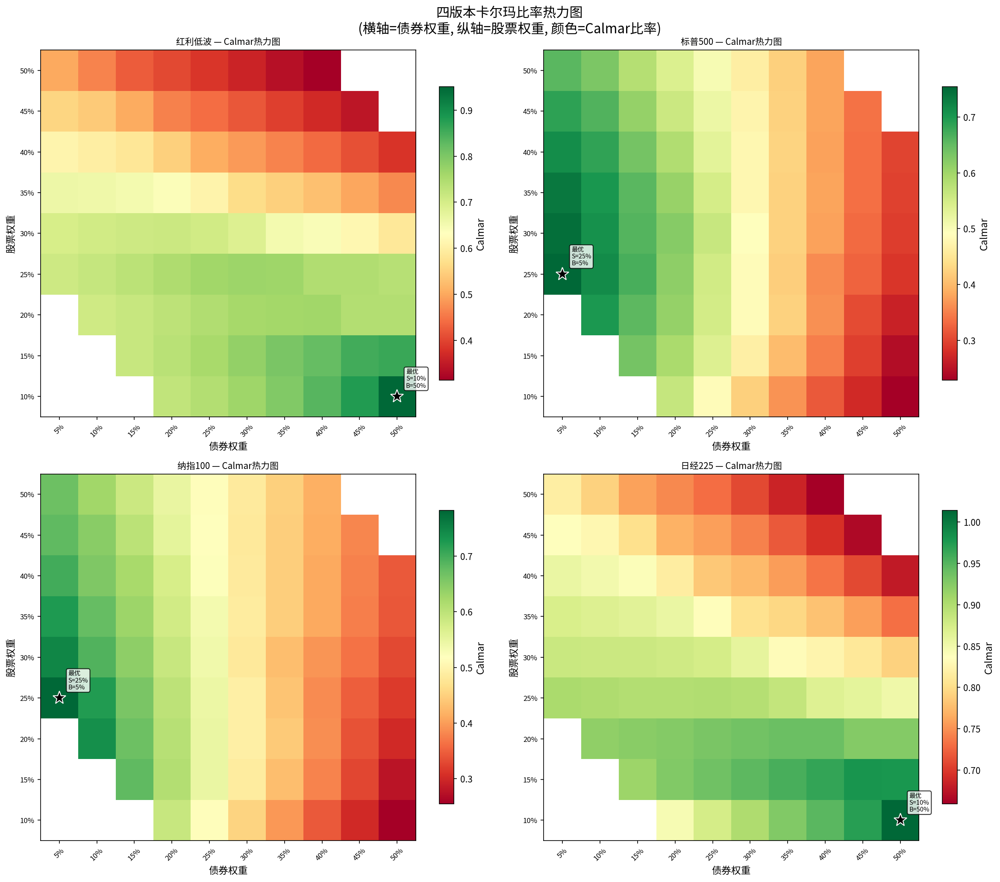
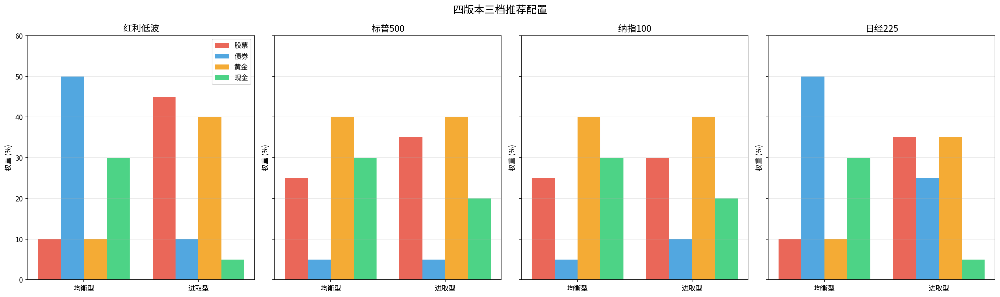
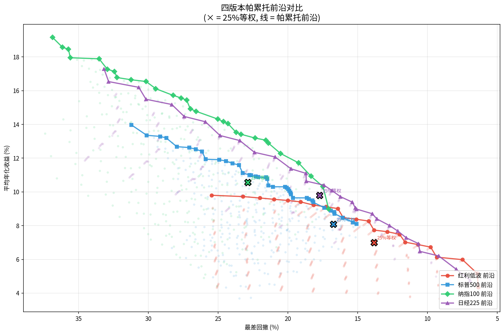
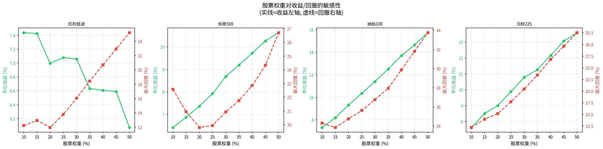

# Permanent Portfolio Daily Backtest — China A-Share & US Markets

> Can you invest on **any random day** and still come out ahead?  
> How long must you hold a permanent portfolio to have **>90% chance of profit**?  
> Does the "25% stocks + 25% bonds + 25% gold + 25% cash" formula work in **China A-shares**?  
> **And if we break the 25% rule — what weights are truly optimal for each stock engine?**
>
> This project answers these questions across **three phases**: Phase 1 validated 25% equal-weight on **12 portfolio groups** (~40,000 entry points, 2003–2026); Phase 2 confirmed 24-month win rates >90%; Phase 3 broke the equal-weight constraint with a **341-combo grid search** across 4 versions.

> **📄 Research paper:** [reports/研究论文.md](reports/研究论文.md) (Phase 1/2, with 10 academic references)
> **📄 Weight optimization paper:** [reports/最优权重分析报告.md](reports/最优权重分析报告.md) (Phase 3, 8 charts, 341 weight combos)
> **📖 中文版:** [README_ZH.md](README_ZH.md)

---

## 📊 Overview

| Item | Details |
|------|---------|
| Backtest period | 2003-01 ~ 2026-06 (23 years) |
| Portfolio groups | **11 total** (2 US + 9 China A-share indices) |
| Entry points tested | ~40,000+ independent entry dates |
| Rebalance rule | ±8% threshold trigger + annual forced reset |
| Trading cost | 0.1% per rebalance |
| Data sources | Yahoo Finance (US) / akshare + Tushare (China) / MySQL (existing) |

---

## 💡 What is the Permanent Portfolio?

Created by **Harry Browne** in his 1987 book *Fail-Safe Investing*, the Permanent Portfolio is a **4-way equal-weight** strategy designed to perform well in any economic environment:

| Asset | Allocation | Purpose | Performs best in |
|-------|:----------:|---------|------------------|
| Stocks | **25%** | Growth | Prosperity (growth) |
| Long-term Bonds | **25%** | Income & deflation hedge | Recession (falling rates) |
| Gold | **25%** | Inflation hedge | Inflation (rising prices) |
| Cash (T-bills) | **25%** | Stability & optionality | Contraction (liquidity crisis) |

The magic comes from **rebalancing**: when one asset surges, you trim it and buy the laggards — automatically buying low and selling high. No market timing, no stock picking, no economic forecasts needed.

> **Key question:** Does this simple formula — which worked brilliantly in the US since the 1970s — also work in China's A-share market, which has higher volatility, retail dominance, and a different economic structure?

### US Portfolio Groups

| Group | Stocks (25%) | Bonds (25%) | Gold (25%) | Cash (25%) | Principal |
|-------|-------------|-------------|------------|------------|-----------|
| S&P 500 | ^SP500TR (Total Return) | TLT ETF | COMEX Gold | 2% p.a. | $100K |
| Nasdaq 100 | ^NDXT (Total Return) | TLT ETF | COMEX Gold | 2% p.a. | $100K |

### China A-Share Portfolio Groups

| Group | Stocks (25%) | Bonds (25%) | Gold (25%) | Cash (25%) | Principal |
|-------|-------------|-------------|------------|------------|-----------|
| CSI 300 | 000300.SH | Fixed 3% | AU.SHF | 2% p.a. | ¥1M |
| SSE 50 | 000016.SH | Fixed 3% | AU.SHF | 2% p.a. | ¥1M |
| CSI 500 | 000905.SH | Fixed 3% | AU.SHF | 2% p.a. | ¥1M |
| CSI 1000 | 000852.SH | Fixed 3% | AU.SHF | 2% p.a. | ¥1M |
| CSI 2000 | 000932.SH | Fixed 3% | AU.SHF | 2% p.a. | ¥1M |
| ChiNext | 399006.SZ | Fixed 3% | AU.SHF | 2% p.a. | ¥1M |
| STAR 50 | 000688.SH | Fixed 3% | AU.SHF | 2% p.a. | ¥1M |
| CSI Dividend | 000922.SH | Fixed 3% | AU.SHF | 2% p.a. | ¥1M |
| Low Vol Dividend | H30269.CSI | Fixed 3% | AU.SHF | 2% p.a. | ¥1M |

---

## 📈 Core Results

```
Rank  Group            Return     CAGR    MaxDD   Sharpe
───────────────────────────────────────────────────────────
 1    Nasdaq 100      +174.9%   10.2%   20.5%    0.80
 2    S&P 500         +168.8%    8.4%   15.4%    0.76
 3    Nikkei 225      +146.8%    9.0%   11.8%    0.86
 4    ChiNext         +112.0%   11.0%   12.0%    0.91
 5    CSI 500          +86.7%    8.4%   12.3%    0.75
 6    Low Vol Div      +80.9%    7.2%    9.2%    0.72  ← lowest drawdown
 7    CSI 2000         +77.1%    6.2%   11.3%    0.53
 8    CSI 300          +76.7%    7.4%   10.7%    0.70
 9    CSI Dividend     +75.7%    7.0%   10.2%    0.68
10    SSE 50           +70.6%    6.8%   11.2%    0.63
11    CSI 1000         +58.4%    9.3%   11.2%    0.80
12    STAR 50          +54.1%   15.2%   10.8%    1.17  ← best Sharpe
```

### Key Findings

1. **All 12 portfolios delivered positive returns from ANY entry date** — confirming the permanent portfolio's "entry timing doesn't matter" property
2. **The strategy works in China A-shares** — 9 China portfolios averaged +76% cumulative, with 64% of entries beating pure stock holding
3. **Low Vol Dividend has the best drawdown control** (9.23%) — naturally defensive stocks make excellent permanent portfolio components
4. **STAR 50 has the highest Sharpe ratio** (1.17) — but short sample period (since 2020) warrants caution
5. **China groups significantly outperform US in drawdown control** — China avg 11.2% vs US avg 17.9%, thanks to the anchoring effect of fixed-rate bonds
6. **Nikkei 225 delivers 9.0% CAGR with only 11.8% drawdown**, Sharpe 0.86 — the best risk-adjusted return across all groups

---

## 📊 Visual Summary

### Return Comparison


The bar chart above shows average cumulative returns across all 11 groups. Nasdaq 100 leads at +174.9%, followed by S&P 500 (+168.8%). Among China A-share groups, ChiNext (创业板指) stands out at +112.0% with a drawdown of only 12.0% — roughly half of the US groups' drawdown.

### Risk-Adjusted Performance (Sharpe Ratio)


STAR 50 (科创50) achieves the highest Sharpe ratio at 1.17, despite having the lowest absolute return (+54.1%). ChiNext and Nasdaq 100 follow closely. Notably, A-share portfolios deliver competitive risk-adjusted returns versus their US counterparts.

### Risk-Return Profile


The scatter plot maps all 11 portfolios on a risk-return plane (annual return vs. max drawdown, colored by Sharpe ratio). The ideal location is the upper-left corner (high return, low drawdown, high Sharpe). Key observations:
- **ChiNext** and **Low Vol Dividend** occupy the premium zone (high Sharpe + low drawdown)
- **US groups** deliver higher absolute returns but with significantly larger drawdowns (right side)
- **CSI 300** and **CSI Dividend** sit in the balanced middle ground

### Distribution of Returns Across Entry Points


All portfolios show right-skewed return distributions — most entry points cluster around the median with a long tail of high returns from early entries (post-crisis bottoms of 2003/2009).

---

## 📁 Directory Structure

```
permanent-portfolio-backtest/
├── README.md                          # This file
├── README_ZH.md                       # Chinese version
├── research_plan.md                   # Original research plan
├── data/
│   ├── raw/                           # Raw collected data (CSV)
│   │   ├── sp500_tr.csv              # S&P 500 Total Return
│   │   ├── nasdaq100_tr.csv          # Nasdaq 100 Total Return
│   │   ├── tlt.csv                   # TLT ETF
│   │   ├── gold_usd.csv              # COMEX Gold
│   │   ├── hs300.csv                 # CSI 300
│   │   ├── 000016_SH.csv             # SSE 50
│   │   ├── 000905_SH.csv             # CSI 500
│   │   ├── 000852_SH.csv             # CSI 1000
│   │   ├── 000932_SH.csv             # CSI 2000
│   │   ├── 000922_SH.csv             # CSI Dividend
│   │   └── H30269_CSI.csv            # Low Vol Dividend
│   └── processed/                    # Aligned price data
│       ├── us_sp500_daily.csv        # US S&P-aligned
│       ├── us_nasdaq_daily.csv       # US Nasdaq-aligned
│       └── cn_daily.csv              # China-aligned
├── results/                          # Backtest results
│   ├── result_sp500.csv             # S&P 500 (5,646 entries)
│   ├── result_nasdaq.csv            # Nasdaq 100 (4,856 entries)
│   ├── result_china.csv             # CSI 300 (3,952 entries)
│   ├── result_china_000016_SH.csv   # SSE 50
│   ├── result_china_000905_SH.csv   # CSI 500
│   ├── result_china_000852_SH.csv   # CSI 1000
│   ├── result_china_000932_SH.csv   # CSI 2000
│   ├── result_china_399006_SZ.csv   # ChiNext
│   ├── result_china_000688_SH.csv   # STAR 50
│   ├── result_china_000922_SH.csv   # CSI Dividend
│   ├── result_china_H30269_CSI.csv  # Low Vol Dividend
│   └── summary_statistics.csv       # Cross-group comparison
├── charts/                           # Visualizations
│   ├── distribution_compare.png     # Return distribution comparison
│   ├── return_bar_compare.png       # Return bar chart
│   ├── sharpe_compare.png           # Sharpe ratio comparison
│   └── risk_return_scatter.png      # Risk-return scatter
├── reports/
│   ├── 研究论文.md            # Phase 1/2 research paper (Chinese, 10 refs)
│   ├── 统计分析报告.md         # Phase 1 full analysis
│   ├── 持有期分析报告.md       # Phase 2 holding period analysis
│   ├── 日经225永久组合回测报告.md # Nikkei 225 standalone report
│   ├── 最优权重分析报告.md      # Phase 3 full analysis (8 embedded charts)
│   └── 最优权重推荐摘要.md      # Phase 3 summary
├── scripts/                          # Backtest & analysis scripts
│   ├── backtest_full.py             # Original full engine
│   ├── run_single.py                # Single-group runner
│   ├── china_backtest.py            # Parameterized China backtest
│   ├── gen_summary_11.py            # 11-group summary
│   ├── gen_charts_11.py             # 11-group charts
│   ├── optimize_weights.py          # Phase 3 weight optimization engine
│   ├── merge_results.py             # Phase 3 result merger
│   ├── gen_charts3.py               # Phase 3 chart generator
│   └── ...                          # Data collection scripts
├── results3/                         # Phase 3 results
│   ├── hongli_lowvol/
│   │   ├── grid_results.csv         # Low Vol Div full grid (341 combos)
│   │   └── top_recommendations.csv  # Tier recommendations
│   ├── sp500/
│   ├── nasdaq/
│   ├── nikkei225/
│   ├── optimal_summary.csv          # Cross-version summary
│   └── pareto_frontiers.csv         # Pareto frontiers
├── charts2/                          # Phase 2 charts
│   ├── win_rate_heatmap.png
│   ├── return_compare_boxplot.png
│   └── ...
├── charts3/                          # Phase 3 charts
│   ├── calmar_heatmap_4panel.png    # 4-panel Calmar heatmap
│   ├── frontier_all_versions.png    # Pareto frontier comparison
│   ├── optimal_allocation_bars.png  # Tier allocation bars
│   └── sensitivity_stock_weight.png # Stock weight sensitivity
└── logs/                             # Run logs
```

---

## 🛠 Quick Reproduce

```bash
# === Phase 1: Equal-weight backtest ===
# Run a single China index backtest
python3 scripts/china_backtest.py 000300.SH

# Or parallel
python3 scripts/china_backtest.py 000016.SH &
python3 scripts/china_backtest.py 000905.SH &

# Generate summary and charts
python3 scripts/gen_summary_11.py
python3 scripts/gen_charts_11.py

# === Phase 3: Optimal weight exploration ===
# Run weight optimization (single version)
python3 scripts/optimize_weights.py hongli_lowvol

# Run all four versions in parallel
python3 scripts/optimize_weights.py hongli_lowvol &
python3 scripts/optimize_weights.py sp500 &
python3 scripts/optimize_weights.py nasdaq &
python3 scripts/optimize_weights.py nikkei225 &
wait

# Merge results + generate charts
python3 scripts/merge_results.py
python3 scripts/gen_charts3.py
```

---

## 📄 Research Paper

A comprehensive research paper is available at **[reports/研究论文.md](reports/研究论文.md)** (Chinese), covering:
- Introduction and literature review (Browne 1987, Brinson 1986, Fama-French 2015, Liu-Stambaugh-Yuan 2019)
- Data sources and methodology
- Full 11-group backtest results with discussion
- **Phase 2: Holding period analysis** (1/3/6/12/24 months, ~40,000 entry points)
- 10 academic references

---

## 📊 Phase 2: Holding Period Analysis

**Core question:** How long must you hold the **permanent portfolio** for a high probability of profit?

> All data below refers to the **permanent portfolio** (25% stocks + 25% bonds + 25% gold + 25% cash), NOT the underlying stock index itself.


| Period | Best US (S&P 500) | Best A-Share (Low Vol Div) |
|:------:|:-----------------:|:--------------------------:|
| 1 month | 64.0% ✅ | 61.2% ✅ |
| 3 months | 73.1% ✅ | 69.8% ✅ |
| 6 months | 79.1% ✅ | 75.0% ✅ |
| 12 months | 85.6% ✅ | 79.4% ✅ |
| **24 months** | **92.9% 🏆** | **91.7% 🏆** |

**Key findings:**
- **Win rates rise monotonically** with holding period across all 11 groups
- **Low Vol Dividend** leads A-shares at 91.7% (24 months) — rivaling US portfolios
- **Not a short-term tool** — 1-month win rates are 50-64% (near coin-flip)
- **Hold ≥12 months** for >65% win rate on all A-share groups (ex STAR 50)
- Full report: [reports/持有期分析报告.md](reports/持有期分析报告.md) (Chinese)
- 10 academic references

---

## 🇯🇵 Nikkei 225 Supplementary Test

Added 2026-06-07: Nikkei 225 permanent portfolio test. Stocks = ^N225, bonds = fixed 1.5% (approximation of Japanese long-term government bonds), gold = GOLD_USD, cash = 0.5%. Over 2003–2026, all 5,277 entry points yielded positive returns: average cumulative +146.8%, annualized 9.0%, max drawdown 11.8%, Sharpe 0.86 (**highest across all groups**).

Full standalone report: [reports/日经225永久组合回测报告.md](reports/日经225永久组合回测报告.md) (Chinese)

---

## 📊 Phase 3: Optimal Weight Exploration

**Core question:** Given different stock engines, what bond/gold/cash ratios are truly optimal?

> Phase 1/2 validated the 25% equal-weight permanent portfolio. Phase 3 breaks the equal-weight constraint, searching across 341 candidate weight combinations to find the optimal allocation for each version.



### Research Design

| Parameter | Details |
|-----------|---------|
| Versions | Low Vol Dividend / S&P 500 / Nasdaq 100 / Nikkei 225 |
| Weight range | Stocks 10–50%, Bonds 5–50%, Gold 5–40%, Cash 5–30% (step 5%) |
| Valid combos | ~**341** per version (must sum to 100%) |
| Backtest method | Every trading day as entry, held to 2026-06-06 |
| Rebalancing | Consistent with Phase 1: ±8% threshold + annual Jan reset, 0.1% cost |
| Total paths | 341 combos × 4 versions × ~5,000 entries ≈ **6.8 million backtest paths** |

### Recommended Allocations

Each version outputs two tiers of recommendations. Percentages = **Stocks / Bonds / Gold / Cash**.

#### Balanced (Calmar-optimal: best risk-adjusted return)

| Version | Allocation | CAGR | Worst DD | Calmar | Sharpe |
|---------|:----------:|:----:|:--------:|:------:|:-----:|
| Low Vol Div | 10/50/10/30 | 4.3% | 6.4% | **1.13** | 1.08 |
| S&P 500 | 25/5/40/30 | 10.3% | 20.2% | **0.75** | 1.38 |
| Nasdaq 100 | 25/5/40/30 | 13.2% | 22.4% | **0.78** | 1.62 |
| Nikkei 225 | 10/50/10/30 | 4.7% | 6.9% | **1.09** | 1.05 |

#### Aggressive (CAGR-optimal, max drawdown ≤ 25%)

| Version | Allocation | CAGR | Worst DD | Calmar | Sharpe |
|---------|:----------:|:----:|:--------:|:------:|:-----:|
| Low Vol Div | 45/10/40/5 | **9.7%** | 23.2% | 0.62 | 1.16 |
| S&P 500 | 35/5/40/20 | **11.9%** | 24.9% | 0.74 | 1.58 |
| Nasdaq 100 | 30/10/40/20 | **14.2%** | 24.6% | 0.70 | 1.62 |
| Nikkei 225 | 35/25/35/5 | **13.3%** | 24.9% | 0.89 | 1.37 |



### Key Findings

1. **Gold is systematically underweighted at 25%** — Optimization pushes gold to 35–40% across all aggressive tiers. Gold's dual role (return engine + crisis hedge) is validated by data

2. **Bonds are drastically compressed** — Aggressive tiers allocate only 5–10% to bonds, far below the traditional 25%. Fixed-rate bonds contribute limited returns in low-rate environments

3. **Low Vol Dividend + bonds = ultra-low drawdown** — The 10/50/10/30 allocation achieves Calmar 1.13 with only 6.4% worst drawdown, the most defensive combination in the study

4. **Nasdaq 100 aggressive tier delivers the highest return** — 30/10/40/20 reaches 14.2% CAGR while staying within acceptable drawdown limits

5. **Nikkei 225 + gold + yen cash form a unique defensive structure** — 10/50/10/30 achieves Calmar 1.09, tying with Low Vol Dividend for the best risk-adjusted score

6. **25% equal-weight is not optimal for any version** — Every version's optimal weights deviate significantly from equal-weight, suggesting investors should tailor allocations to their underlying stock characteristics





> 📄 Full analysis report: [reports/最优权重分析报告.md](reports/最优权重分析报告.md) (Chinese, 8 embedded charts)
> 📄 Research plan: [研究計画3.md](研究計画3.md) (Chinese)

---

## 📜 License

MIT License © 2026 Miaomao27

This project is for research and educational purposes only. The backtest results do not constitute investment advice. Past performance does not guarantee future returns. See [LICENSE](LICENSE) for full terms.
