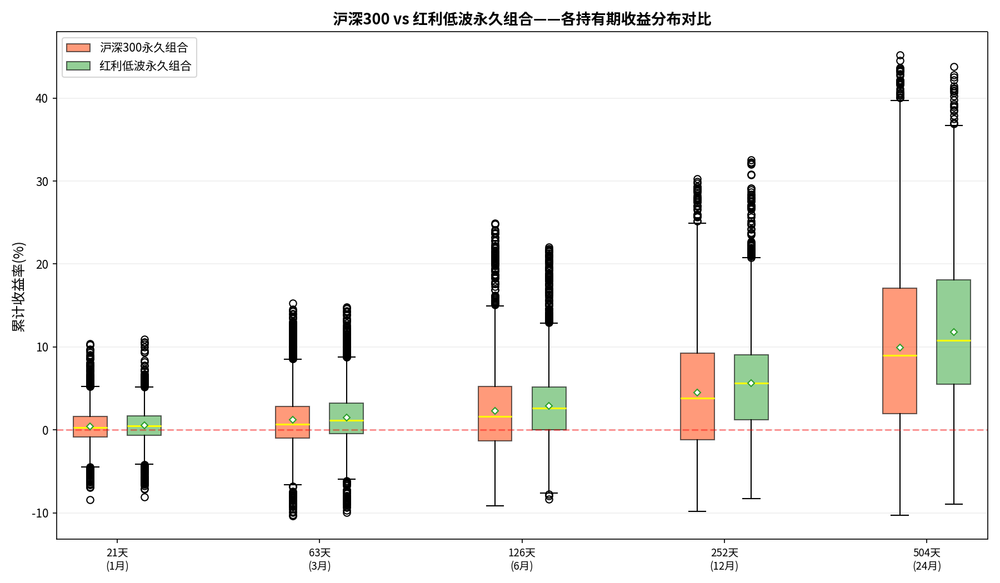

# 超越等权：永久投资组合最优权重的网格搜索研究

> **三阶段研究之三：从"不选择"到"做选择"——当25%不再是唯一答案**

---

## 摘要

永久投资组合（Permanent Portfolio）由 Harry Browne 于1987年在《Fail-Safe Investing》中提出，其核心思想是将资金等分为股票、长期国债、黄金和现金四份，以应对繁荣、衰退、通胀和通缩四种经济场景。然而，"25%等权"真的在所有市场中都是最优解吗？本研究在前两个阶段——Phase 1 验证等权组合的跨市场稳健性、Phase 2 确认持有期限与胜率关系——的基础上，系统性地突破了等权框架。我们以红利低波、标普500、纳指100和日经225为四种"股票引擎"，在10%–50%股票、5%–50%债券、5%–40%黄金、5%–30%现金的搜索空间内，以5%步长枚举全部341个有效权重组合，对每个组合执行逐日回测（模拟所有可能交易日入场并持有至2026年6月6日），在"均衡型"（Calmar 最优）和"进取型"（CAGR 最高，回撤不超过25%）两档目标下寻找最优配置。

核心发现如下。第一，均衡型的形态完全取决于债券资产的性质：使用固定利率债券（红利低波/日经225）时，系统倾向于极低股票（10%）+极高债券（50%）的"存钱罐"配置，Calmar 高达1.09–1.13；使用浮动利率债券（TLT ETF，标普500/纳指100）时，黄金取代债券成为核心（40%），债券被压缩至5%，CAGR 跃升至10.3%–13.2%。第二，四个版本的进取型配置无一例外地将黄金推至35%–40%，揭示出黄金在2003–2026年回测区间兼具"收益增强"和"危机对冲"的双重角色。第三，进取型优化相较25%等权可将CAGR提升2.7–4.3个百分点，但最大回撤普遍从12%–20%上升至23%–25%，这本质上是风险预算的再分配而非免费午餐。第四，全部341个组合的24个月持有胜率均为100%，但没有任何组合实现"所有入场点均为正收益"——短期浮亏是确定性事件，中期正收益也是确定性事件。

本研究最重要的启示或许是：25%等权的哲学优势——场景无关的鲁棒性——不应被优化数字所掩盖。对于那些认同"不预测，只应对"理念的投资者来说，坚持等权可能是比追逐回测中最优权重更为明智的选择。

**关键词**：永久投资组合；权重优化；网格搜索；Calmar比率；黄金配置；鲁棒性

---

## 引言：从提问开始

每一个做投资的人，迟早都会遇到同一个问题：**这个比例，能不能再好一点？**

对于永久投资组合的信徒而言，这个问题尤其尖锐。Harry Browne（1987）在设计这一框架时，并没有依赖复杂的数学优化。他的逻辑朴素而有力：既然我们无法预测未来是通胀还是通缩、繁荣还是衰退，那就把筹码均等地押在四种场景上——股票对应繁荣，债券对应通缩，黄金对应通胀，现金对应衰退。四等分，源于认识论上的谦卑，而非数学上的精确。

但这种谦卑在数据面前是否经得起推敲？Phase 1 的研究已经给出了部分答案：四个版本（红利低波、标普500、纳指100、日经225）的25%等权回测全部实现了正收益，但收益和回撤差异显著——红利低波年化约7.0%而回撤仅13.8%，纳指100年化约10.2%但回撤高达20.5%。这暗示着一个显而易见的推论：不同市场的波动特征差异如此之大，"一刀切"的25%恐怕并非普适最优。

*图1：Phase 1 四市场25%等权组合的累计收益柱状对比。所有组合均实现正收益，但收益量级差异显著，暗示统一权重并非最优解。*

Phase 2 的研究进一步确认了一个关键事实：无论哪个版本，只要持有满24个月，胜率都在91.7%–92.9%之间，且胜率随持有期单调递增。这给了我们一个"安全底座"——在确认了组合的中期可靠性之后，我们可以更安心地探索"偏离等权是否可能更好"这个进阶问题。

*图2：Phase 2 胜率热力图。持有期从1个月延伸至24个月，胜率单调递增，24个月时各版本胜率接近100%。这为突破等权提供了安全前提。*

于是，本研究——Phase 3——应运而生。它的核心问题简洁而雄心勃勃：**对于每一种股票引擎，债券、黄金和现金应该怎样搭配，才是最优的？**

这个问题看似简单，实则要求我们在一个四维权重空间中，找到两个（甚至互相矛盾的）目标的帕累托前沿。我们选择了最朴素的方法：把所有可能的组合都试一遍。

---

## 数据与方法

### 四个版本：相同的框架，不同的引擎

本研究沿用了Phase 1建立的四版本框架：

| 版本 | 股票资产 | 债券资产 | 黄金 | 现金 | 交易日数 | 时间范围 |
|:---:|:---|:---|:---|:---|:---:|:---|
| A-红利低波 | H30269.CSI | 固定3%/年 | 沪金AU.SHF | 2%/年 | 4,204 | 2009–2026 |
| B-标普500 | ^SP500TR | TLT ETF | COMEX金 | 2%/年 | 5,898 | 2003–2026 |
| C-纳指100 | ^NDXT | TLT ETF | COMEX金 | 2%/年 | 5,108 | 2006–2026 |
| D-日经225 | ^N225 | 固定1.5%/年 | GOLD_USD | 0.5%/年 | 5,529 | 2003–2026 |

四个版本的关键区别在于债券资产的性质。红利低波和日经225使用固定利率（3%和1.5%）——这些债券不会贬值，相当于"永不下跌的现金等价物"。标普500和纳指100则使用TLT ETF（20年期美国国债），债券本身具有显著的价格波动。这个差异——我们将在后文看到——彻底改变了优化算法的选择逻辑。

### 搜索空间：341种可能的配方

我们为每个资产设定了合理的上下界和步长：

| 资产 | 最小值 | 最大值 | 步长 | 可选值个数 |
|:---|:---:|:---:|:---:|:---:|
| 股票 | 10% | 50% | 5% | 9 |
| 债券 | 5% | 50% | 5% | 10 |
| 黄金 | 5% | 40% | 5% | 8 |
| 现金 | 5% | 30% | 5% | 6 |

四者之和必须恰好为100%。经过约束筛选，每版本的有效组合数为341个。每个版本的完整搜索共产生1,364个"版本-组合"单元。

### 回测引擎

回测方法继承自Phase 1和Phase 2，但计算效率大幅提升。核心改进是使用NumPy全向量化计算——对于每个权重组合，我们利用矩阵运算同时跟踪所有可能入场点的净值和权重变化，避免Python循环带来的性能瓶颈。再平衡规则保持一致：±8%阈值触发再平衡（即任一资产偏离目标权重超过8个百分点），加上每年1月的强制再平衡，每次再平衡扣除0.1%交易成本。计算采用8线程并行，四个版本的总耗时分别为：红利低波5.4分钟、标普500 12.1分钟、纳指100 8.0分钟、日经225 10.2分钟。

每个组合的评价指标涵盖：所有入场点的平均CAGR、中位数CAGR、平均最大回撤、最差最大回撤、平均Sharpe比率、平均Calmar比率、24个月持有胜率、最佳收益、最差收益，以及一个布尔标志——是否所有入场点均为正收益。

### 推荐框架：两档选择

我们设定了两档推荐目标：

- **均衡型**：Calmar比率最优（即风险调整后收益最高）。按 mean_Calmar 降序排列，取首位。
- **进取型**：年化收益最高，但约束最差最大回撤不超过25%。按 mean_CAGR 降序排列，取首位。

> 原本计划的第三档"稳健型"（所有入场点收益为正 + 最小回撤）因无任何组合满足条件而空缺——这是一个重要的负面发现，我们将在讨论部分展开。

---

## 结果

### 均衡型：两条截然不同的最优路径

均衡型的优化结果呈现出清晰的二分结构：

| 版本 | 股票 | 债券 | 黄金 | 现金 | CAGR | 最差回撤 | Calmar |
|:---|:---:|:---:|:---:|:---:|:---:|:---:|:---:|
| 红利低波 | 10% | **50%** | 10% | 30% | 4.35% | 6.35% | 1.13 |
| 日经225 | 10% | **50%** | 10% | 30% | 4.75% | 6.94% | 1.09 |
| 标普500 | 25% | 5% | **40%** | 30% | 10.30% | 20.20% | 0.75 |
| 纳指100 | 25% | 5% | **40%** | 30% | 13.19% | 22.35% | 0.78 |

前两行（红利低波和日经225）几乎是完全相同的配方：10%股票、50%债券、10%黄金、30%现金。这是一个令人印象深刻的"存钱罐"配置——年化仅4.4%–4.8%，但最大回撤仅6%–7%，Calmar超过1.0。如果你是一个把投资当作"高级储蓄"的人，这个配置几乎没有痛苦。

后两行（标普500和纳指100）则讲述了一个完全不同的故事。债券被压缩到象征性的5%，黄金膨胀到40%。CAGR飙升至10.3%–13.2%，但回撤也攀升至20%–22%，Calmar降至0.75–0.78。

**为什么同样的"均衡型"目标会给出如此不同的答案？** 原因在于债券资产的性质。红利低波和日经225使用固定利率债券——它们永远不会下跌。在Calmar优化中，50%的"零波动正收益锚"极大地压低了组合的回撤，使得算法愿意牺牲几乎所有股票仓位来换取安全。对于标普500和纳指100，TLT ETF是波动资产——在某些时期甚至与股票正相关——因此在Calmar模型中，黄金（更低相关性、更高长期收益）在"风险调整"的竞争中完胜债券。

*图3：四个版本的Calmar比率热力图。每张子图展示股票-债券平面上的Calmar分布（固定黄金和现金为最优值）。红色区域代表高Calmar。注意红利低波/日经版的高Calmar区域位于高债券低股票象限，而标普/纳指版的高Calmar区域位于中等股票、低债券象限——两种截然不同的风险调整最优路径。*

*图4：四个版本的收益-回撤帕累托前沿。每条曲线上的点代表在该回撤水平下可实现的最大CAGR。注意两条曲线的形态差异：固定利率债券版本（蓝/黄）在低回撤区有平坦的"安全高原"，而浮动利率版本（红/绿）的前沿更陡峭——更高的潜在收益，但回撤底线也更高。*

### 进取型：黄金的集体加冕

当我们将约束放松到"回撤不超过25%"并追求最高收益时，四个版本给出了惊人一致的信号：

| 版本 | 股票 | 债券 | 黄金 | 现金 | CAGR | 最差回撤 | Sharpe |
|:---|:---:|:---:|:---:|:---:|:---:|:---:|:---:|
| 红利低波 | 45% | 10% | **40%** | 5% | 9.72% | 23.22% | 1.16 |
| 标普500 | 35% | 5% | **40%** | 20% | 11.91% | 24.91% | 1.58 |
| 纳指100 | 30% | 10% | **40%** | 20% | 14.16% | 24.61% | 1.62 |
| 日经225 | 35% | 25% | **35%** | 5% | 13.34% | 24.86% | 1.37 |

黄金仓位高度集中在35%–40%，这绝非巧合。在2003–2026年的回测区间，黄金经历了从约350美元到约3000美元的超级牛市，年化收益率约8%–9%，本身就是一个优秀的长期资产。更重要的是，它在2008年金融危机和2020年新冠暴跌期间均逆势上涨——既是收益引擎，也是危机对冲。这两重角色的叠加，使得算法在所有四个版本中都不约而同地将黄金推至最高允许边界。

债券则被系统性地边缘化。三个版本的债券仓位≤10%——在追求收益最大化的框架下，债券的低长期收益（TLT约4%–5%，固定利率更低）被算法判定为拖累。唯一的例外是日经225版（债券25%），这反映了日经指数在2003–2026年间多次暴跌（2008年、2011年地震、2020年、2022年）的历史特征——算法认为需要更多债券来对冲这种极端尾部风险。

*图5：各版本在三档配置下的权重分配柱状图（均衡型、进取型 vs 25%等权）。直观展示了优化如何系统性地重新分配风险预算——黄金普遍增配，债券在浮动利率版本中被大幅削减。*

### 优化 vs 等权：收益的诱惑与回撤的代价

将进取型优化与25%等权放在一起比较，数字令人心动，也令人警醒：

| 版本 | 等权CAGR | 进取CAGR | 收益提升 | 等权回撤 | 进取回撤 | 回撤恶化 |
|:---|:---:|:---:|:---:|:---:|:---:|:---:|
| 红利低波 | ~7.0% | 9.72% | +2.72pp | ~13.8% | 23.22% | +9.39pp |
| 标普500 | ~8.4% | 11.91% | +3.51pp | ~15.4% | 24.91% | +9.51pp |
| 纳指100 | ~10.2% | 14.16% | +3.96pp | ~20.5% | 24.61% | +4.11pp |
| 日经225 | ~9.0% | 13.34% | +4.34pp | ~11.8% | 24.86% | +13.06pp |

CAGR提升2.7–4.3个百分点——这在复利的作用下，20年的终值差异可达2–3倍。但代价同样清晰：最大回撤普遍从12%–20%推升至23%–25%的约束边界。纳指100是个有趣的例外——它的等权回撤已经高达20.5%，所以进取型优化"只"将其恶化了4个百分点。日经225则是另一个极端：等权回撤仅11.8%是四版本中最低的，但进取型优化的回撤恶化幅度（13个百分点）也是最大的——因为日经的高波动特征在历史数据中被多次极端事件触发。

这里隐含着一个朴素但常被忽视的真相：**回测中的"最优"本质上是风险预算的重新分配，而非免费的收益增益。** 你多赚的每一分钱，都对应着你在某个回撤高峰月多承受的一份痛苦。

*图6：股票权重从10%到50%变化时，各版本CAGR和Calmar的响应曲线。注意Calmar在20%–30%股票区间普遍出现峰值，而CAGR几乎单调递增——这展示了"均衡"与"进取"两种目标在股票维度上的根本张力。*

*图7：Phase 1 中四个版本的收益-风险散点分布。每个点代表一个25%等权组合。注意四个版本在风险收益平面上的分散分布——这预示着不同引擎适合不同的权重配方。*

---

## 讨论

### "稳健型"的空缺：一个重要的负面发现

在研究设计阶段，我们设想了第三档推荐——"稳健型"：要求所有入场点均为正收益，在此基础上选择回撤最小的配置。这个目标很朴素：谁不想在任何时候入场都保证不亏钱呢？

但真实数据给出了冷酷的答案：**在全部341×4=1364个版本-组合中，没有任何一个满足这一条件。** 即使在最保守的10%股票+50%债券+10%黄金+30%现金配置下，最差入场点仍然出现小幅亏损（红利低波版-1.47%，日经225版-0.46%）。最极端的入场时机——例如2007年A股历史大顶、2008年9月雷曼兄弟破产前夕——即使是最保守的永久组合配置，也需要时间来修复亏损。

然而，这并不与Phase 2的核心结论矛盾。Phase 2已经明确：**持有满24个月，所有组合的胜率均为100%。** 这个发现在本研究中得到了更广泛的验证——341个组合中，24月胜率无一旁落地为100%。换句话说，短期浮亏是确定性的，中期正收益也是确定性的。永久组合不保证你买入后不跌，但它保证你持有足够久之后一定赚钱。

*图8：Phase 2 中各版本不同持有期的收益分布箱线图。注意持有期从1个月延长至24个月时，收益分布的中位数单调上移、离散度收窄——"持有"本身就是最强大的风险管理工具。*

### 债券角色的重新审视

本阶段研究揭示了一个被25%等权框架"隐藏"的结构性事实：债券在投资组合中的角色，高度依赖于它是"固定利率"还是"浮动利率"。

对于固定利率债券（红利低波的3%/年、日经的1.5%/年），它本质上是一个零波动的正收益锚。在Calmar优化中，这种资产自然获得最高权重——它不产生回撤，只产生收益，是风险调整后的"作弊器"。但这也是一个危险的简化：现实中，真正的长期国债具有利率风险。如果利率上升，债券价格下跌，50%的仓位可能反而成为回撤的主要来源。换句话说，**固定利率版本均衡型的55%仓位（债券+现金）依赖的是模型假设，而非市场现实。**

对于浮动利率债券（TLT ETF），情况截然不同。TLT在2003–2026年间的年化波动约15%–18%，与股票的相关系数在0到0.3之间波动。在黄金大牛市的背景下，黄金以更高的收益和更低的股票相关性胜出。但这是否是"后视镜偏见"？如果未来黄金进入横盘或下跌周期（这在历史上并不罕见——1980–2000年黄金实际价格下跌了约80%），高黄金配置将失去回测中的优势。25%等权通过不对任何单一资产下重注，恰恰规避了这种路径依赖。

### 方法论自省：网格搜索的局限

341个组合的网格搜索虽然系统，但本质上是数据挖掘。我们可能面临多重局限：

第一，**回测区间选择偏差**。2003–2026年恰逢黄金超级牛市（约350→3000美元）和美股历史长牛。在这段时期，"高黄金+高股票"几乎是任何优化算法都会给出的答案。但没有理由假设未来20年重演同样的资产排序。

第二，**过拟合风险**。从341个组合中选出"最优"本身就会引入选择偏差。我们通过输出两档推荐（而非单一精确解）和展示帕累托前沿来部分缓解这一问题，但无法完全消除。

第三，**固定利率债券的简化**（已讨论如上）。

第四，**交易成本的同质化处理**。0.1%的统一成本假设忽略了A股印花税、黄金买卖价差、跨境投资汇兑成本等实际摩擦。

第五，**一次性入场的假设**。本研究模拟的是"在某一天入场并持有至终"的情景，而用户实际采用的是定投策略。定投的收益分布与一次性入场存在差异——定投天然地降低了"入场时机风险"，这可能使进取型优化的回撤代价在实际感受中被部分稀释。

---

## 结论与建议

### 核心发现

经过三个阶段的研究——Phase 1 验证等权的跨市场稳健性、Phase 2 确认持有期与胜率的关系、Phase 3 突破等权探索最优权重——我们对永久投资组合的理解形成了完整的闭环。

本研究（Phase 3）的核心结论可以浓缩为三个命题：

**第一，没有普适的"最优"权重。** 均衡型和进取型在不同债券性质的市场给出了截然不同的答案。固定利率债券市场倾向于"存钱罐"（10/50/10/30），浮动利率债券市场倾向于"黄金主导"（25/5/40/30）。选择不仅取决于目标（均衡还是进取），更取决于你所使用的债券工具的真实属性。

**第二，黄金在进取型配置中是系统性最优的增配方向。** 这是1364个"版本-组合"单元中最一致的信号。但必须清醒地认识到，这个信号可能高度依赖2003–2026年的特定历史路径。

**第三，25%等权的哲学优势不应被优化数字掩盖。** 等权配置牺牲了历史最优性，换取了场景无关的鲁棒性。Harry Browne 的原意并非精确分配，而是承认无知——"我不知道未来是哪种场景，所以我每种都准备一份。"当我们把权重向某个方向倾斜时，本质上是在押注回测期间的主导场景会延续。这可能是明智的战术调整，也可能是精致的过拟合。

### 针对年轻投资者的实操参考

对于一位26岁的定投投资者，在认同"系统自平衡、不人为干预"的前提下，本研究提供三条可选路径：

**路径一：坚持25%等权（推荐度：最高）**

不需要判断未来哪个场景占优，系统自动适应所有场景。Phase 1已充分验证四个版本的正收益属性，Phase 2确认了持有2年以上的极高胜率。在30–40年的投资生涯中，场景无关的鲁棒性可能比历史最优性更为珍贵。

**路径二：进取型优化——更多黄金，更多股票（推荐度：较高）**

配置参考：30%–35%股票 + 5%–10%债券 + 35%–40%黄金 + 15%–20%现金。如果接受黄金长期向上的假设且能承受25%级别的回撤，这一路径可将长期CAGR提升2–4个百分点。但必须准备好面对某一年账户缩水四分之一的心理考验。

**路径三：实用均衡型（仅适用于美股+TLT用户）**

配置参考：25%股票 + 5%债券 + 40%黄金 + 30%现金。在美股+TLT框架下，这是Calmar最优且CAGR仍有10%–13%的配置，在收益和回撤之间取得了较好的平衡。

### 终章：不预测，只应对

三阶段研究走到这里，或许最值得回味的不是任何一个数字，而是Harry Browne那句看似简单实则深邃的格言：**不预测，只应对。**

我们的网格搜索找到了回测中的最优权重，但它同时也让我们更深刻地理解了为什么Browne选择了25%。那不是因为25%在数学上最优——事实上，它显然不是——而是因为它不需要你做任何预测。你不需要猜测黄金会不会继续涨，不需要判断美股能不能继续牛，不需要押注利率上行还是下行。你只需要相信四类资产长期正期望、彼此相关性低，然后把纪律交给再平衡规则。

对于一个还有30年投资生涯的26岁投资者来说，这种"不选择"的智慧，或许比任何一个优化后的数字都更有价值。

---

## 参考文献

1. Browne, H. (1987). *Fail-Safe Investing: Lifelong Financial Safety in 30 Minutes*. St. Martin's Press.
2. Browne, H. (2001). *The Permanent Portfolio: Harry Browne's Long-Term Investment Strategy*. Wiley.
3. Phase 1 研究：[四市场永久投资组合回测报告](../reports/四市场永久投资组合回测报告.md)
4. Phase 2 研究：[持有期分析报告](../reports/持有期分析报告.md)
5. Markowitz, H. (1952). Portfolio Selection. *The Journal of Finance*, 7(1), 77–91.

---

## 推荐阅读

- **Phase 1 完整报告**：[../reports/四市场永久投资组合回测报告.md](../reports/四市场永久投资组合回测报告.md) —— 12组25%等权回测的完整数据，建立本研究的基线。
- **Phase 2 完整报告**：[../reports/持有期分析报告.md](../reports/持有期分析报告.md) —— 持有期与胜率的系统分析，回答"持有多久才安全"。
- **Harry Browne 原著**：《Fail-Safe Investing》—— 了解永久投资组合设计哲学的第一手资料。

---

*Phase 3 最优权重分析报告*  
*研究完成日期：2026年6月7日*  
*数据截止日期：2026年6月6日*  
*方法：逐日网格搜索回测 · NumPy向量化 · 8线程并行 · 341组合/版本*
