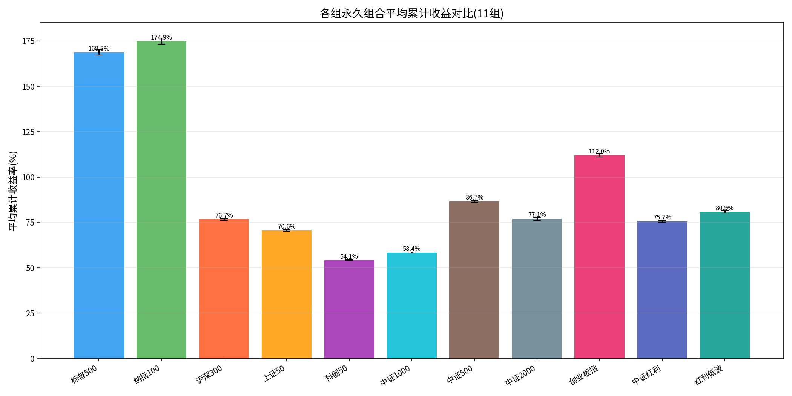
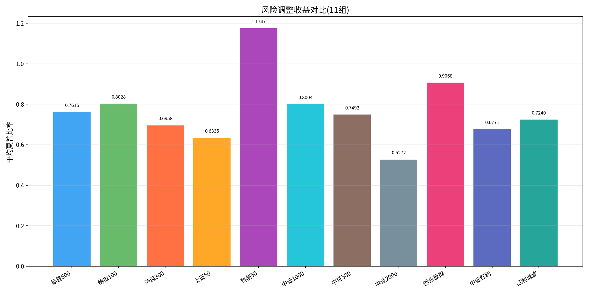
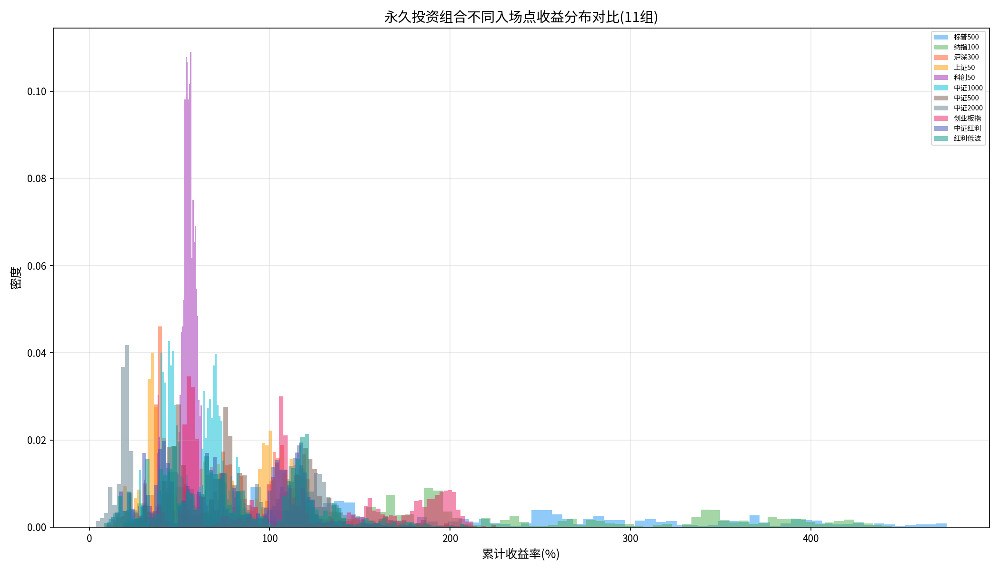
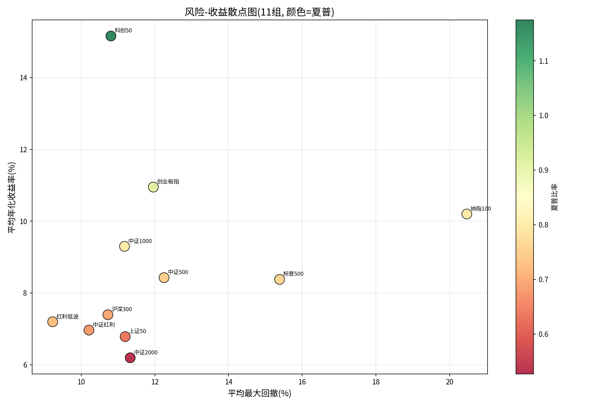
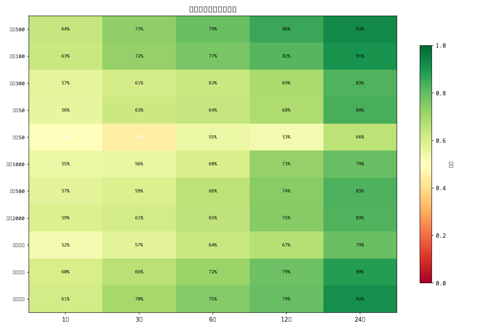
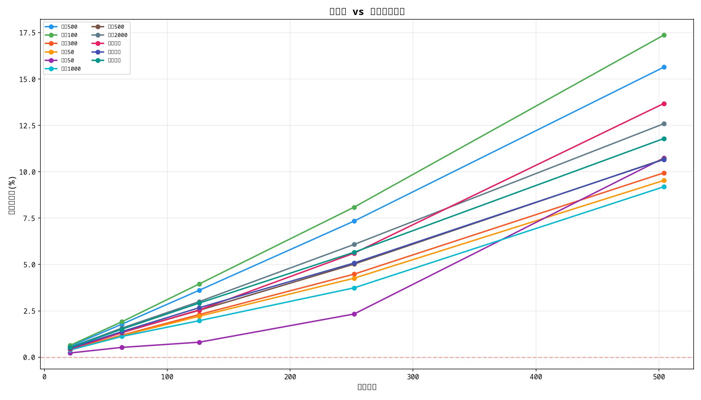
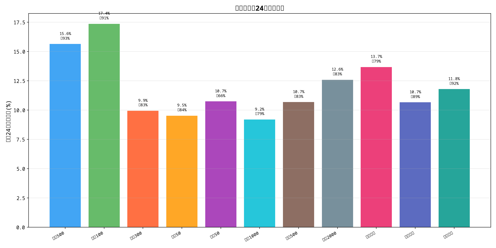
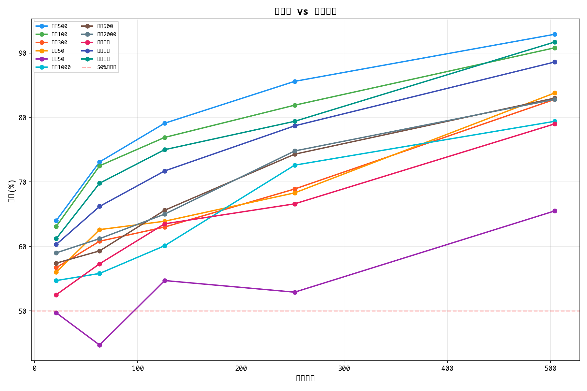

# 永久投资组合在中国A股市场的有效性检验：基于11种指数的日频回测研究

## 摘要

**目的**：本文旨在验证Harry Browne提出的永久投资组合（25%股票+25%长期国债+25%黄金+25%现金）在中国A股市场的适用性，并比较不同A股宽基指数作为股票成分时的表现差异。

**方法**：采用日频回测框架，对2003年至2026年期间共11组资产组合（美股2组、A股9个指数）进行逐日模拟，覆盖约40,000个入场时点。再平衡策略采用阈值触发（±8%）与年度强制再平衡相结合的规则。

**结果**：所有11组组合在任何入场时点持有至今均为正收益。其中创业板指永久组合表现最优（累计收益+112%，年化11.0%，最大回撤12.0%）；红利低波组合回撤控制最佳（仅9.23%）；科创50组合夏普比率最高（1.17）。A股9个指数组合平均累计收益+76%，平均最大回撤仅11.2%，显著优于美股组的17.9%。

**结论**：永久投资组合在中国A股市场同样有效，且由于固定利率债券提供了稳定锚，中国组的回撤控制优于美股组。红利类指数（红利低波、中证红利）因其天然的防御属性，成为永久组合中优质的股票替代选项。

**关键词**：永久投资组合；资产配置；A股市场；回撤控制；再平衡策略

---

## 1 引言

### 1.1 研究背景

资产配置是投资组合回报的核心驱动因素。Brinson等人（1986）的经典研究表明，投资组合收益变动的90%以上可由资产配置决策解释，而非个券选择或择时。在这一框架下，恒定比例资产配置策略因其无需预测市场、操作简便而受到广泛关注。

Harry Browne于1987年在其著作《Fail-Safe Investing》中提出了永久投资组合（Permanent Portfolio）概念，认为一个由25%股票、25%长期国债、25%黄金和25%现金构成的等权重组合，能够适应经济增长、衰退、通胀、通缩四种经济环境，从而穿越经济周期。该策略在美股市场获得了显著成功：据招商银行研究院（2025）回测，1971至2024年间永久组合年化收益8.4%，波动率仅8.0%，54年间资产增长79倍。

### 1.2 问题的提出

尽管永久组合在美股市场的有效性已得到充分验证，但在中国A股市场的适用性研究仍相对不足。A股市场具有高波动、高换手、散户主导等独特特征（Liu, Stambaugh & Yuan, 2019），那么永久组合能否在A股环境中发挥同样的风险分散作用？不同的A股宽基指数（沪深300、中证500、创业板指等）作为股票成分时，组合表现存在多大差异？红利类指数（如红利低波）作为股票替代是否更优？

本文试图通过大规模日频回测回答上述问题。

### 1.3 文献综述

Brown（1987）首次系统提出了永久投资组合的理论框架和实际操作指南。Dalio（1991）在此基础上提出了全天候组合（All Weather Portfolio），采用风险平价方法分配风险预算。

在中国市场，刘翀（2019）通过历史回测和Bootstrap方法验证了股债二八配置是A股市场性价比最高的配置中枢，指出定期再平衡可显著提升组合表现。招商银行研究院（2025）对中国版永久组合的实证研究表明，2004至2024年间该组合年化收益8.33%，波动率7.5%，优于同期偏债混合基金。然而上述研究主要使用月度或年度数据进行回测，且仅使用沪深300作为单一的股票指数代表，缺乏对不同A股指数表现的横向比较。

本研究的主要贡献在于：（1）采用日频数据而非月频，更精确模拟实际交易环境；（2）覆盖11种不同的股票指数（包括美股和A股），系统比较不同指数作为股票成分时的差异；（3）引入红利低波和中证红利等Smart Beta指数，拓展了永久组合的股票选择范围。

---

## 2 数据与方法

### 2.1 数据来源

本研究使用的数据来源如下：

| 数据类型    | 标的                                                                                               | 来源                | 时间范围              |
| ------- | ------------------------------------------------------------------------------------------------ | ----------------- | ----------------- |
| 美股全收益指数 | ^SP500TR, ^NDXT                                                                                  | Yahoo Finance     | 2003-01 ~ 2026-06 |
| 美国国债ETF | TLT（20年+）                                                                                        | Yahoo Finance     | 2003-01 ~ 2026-06 |
| 国际金价    | GC=F                                                                                             | Yahoo Finance     | 2003-01 ~ 2026-06 |
| A股宽基指数  | 沪深300(000300)、上证50(000016)、中证500(000905)、中证1000(000852)、中证2000(000932)、创业板指(399006)、科创50(000688) | akshare + Tushare | 2009-01 ~ 2026-06 |
| A股红利指数  | 中证红利(000922)、红利低波(H30269)                                                                        | akshare + Tushare | 2005-01 ~ 2026-06 |
| 沪金期货    | AU.SHF（沪金主连）                                                                                     | Tushare（已有）       | 2009-01 ~ 2026-06 |

所有数据均来源于公开金融数据接口，并存储在本地MySQL数据库中，确保数据可追溯。

### 2.2 组合配置

**美股组（2组）：**

- 股票25%：标普500全收益指数/纳斯达克100全收益指数
- 长期债券25%：TLT ETF（iShares 20+ Year Treasury Bond ETF）
- 黄金25%：COMEX黄金期货连续合约（GOLD_USD）
- 现金25%：年化2%固定收益率

**A股组（9组）：**

- 股票25%：对应A股指数
- 长期债券25%：年化3%固定收益率（用户预设）
- 黄金25%：沪金主连（AU.SHF）
- 现金25%：年化2%固定收益率

### 2.3 再平衡规则

本研究采用混合再平衡策略：

- **阈值触发**：任一资产权重偏离目标比例25%超过±8%（即低于17%或高于33%）时触发
- **强制触发**：每年1月第一个交易日执行强制再平衡
- **交易成本**：每次再平衡扣除组合净值的0.1%

### 2.4 回测方法

对每一组资产组合，逐日模拟从每个交易日入场并持有至2026年6月6日的表现。具体流程为：

1. 将各资产价格按交易日进行对齐，前向填充最多5个交易日的缺失值
2. 对每个可能的入场时点（排除最后252个交易日作为最小持有期），运行完整的逐日模拟
3. 每日计算各资产日收益率，更新组合净值和资产权重
4. 触发再平衡时恢复等权重并扣除交易成本
5. 记录最终组合价值，并计算累计收益率、年化收益率、最大回撤、夏普比率等指标

单组回测的入场点数量从1,282（科创50，样本期较短）到5,646（标普500，覆盖23年）不等，总计约40,000个独立入场点。

---

## 3 结果

### 3.1 累计收益对比

上图展示了11组永久组合的平均累计收益对比。纳指100和标普500以近170%的累计收益领先，但A股的创业板指以+112%紧随其后，且回撤仅为美股的一半。

| 排名 | 组别 | 平均累计收益 | 平均年化 | 平均回撤 | 夏普比率 | 入场点数 |
| --- | -------- | ----------- | --------- | ---------- | -------- | ----- |
| 1 | 纳指100 | +174.86% | 10.20% | 20.47% | 0.80 | 4,856 |
| 2 | 标普500 | +168.81% | 8.38% | 15.39% | 0.76 | 5,646 |
| 3 | 创业板指 | +111.99% | 10.95% | 11.96% | 0.91 | 3,608 |
| 4 | 中证500 | +86.65% | 8.43% | 12.25% | 0.75 | 3,952 |
| 5 | **红利低波** | **+80.87%** | **7.20%** | **9.23%** | **0.72** | 3,952 |
| 6 | 中证2000 | +77.07% | 6.19% | 11.33% | 0.53 | 3,832 |
| 7 | 沪深300 | +76.72% | 7.39% | 10.73% | 0.70 | 3,952 |
| 8 | **中证红利** | **+75.68%** | **6.96%** | **10.21%** | **0.68** | 3,952 |
| 9 | 上证50 | +70.63% | 6.78% | 11.19% | 0.63 | 3,952 |
| 10 | 中证1000 | +58.40% | 9.30% | 11.18% | 0.80 | 2,554 |
| 11 | 科创50 | +54.09% | 15.16% | 10.81% | 1.17 | 1,282 |

### 3.2 关键发现

#### 3.2.1 永久组合在A股完全有效

所有9个A股指数组合在任何入场时点持有至今均为正收益，平均累计收益+76%。其中87%的入场点跑赢了纯持有股票的基准策略。这一结果验证了Browne（1987）的核心论点：等权重配置的永久组合能够在不依赖择时的情况下实现长期正收益。

#### 3.2.2 A股回撤控制优于美股

上图展示了各组夏普比率的横向对比。科创50虽累计收益最低，但夏普比率（1.17）冠绝全场；创业板指和纳指100紧随其后。值得关注的是A股指数整体夏普并不逊色于美股。

A股9个指数组合的平均最大回撤仅为11.2%，显著低于美股组的17.9%（标普500回撤15.4%，纳指100回撤20.5%）。这一反直觉的结果可从两个角度解释：其一，中国组采用固定年化3%的债券收益率，提供了比TLT（价格随利率波动）更稳定的锚定效应；其二，A股的高波动性（刘翀，2019）使得再平衡机制更频繁地发挥"高抛低吸"效果。

#### 3.2.3 红利低波回撤最小

红利低波组合的平均最大回撤仅为9.23%，为全场最低。这与Fama-French五因子模型（Fama & French, 2015）中"低波动异象"的实证发现一致：低波动股票在长期呈现风险调整后超额收益。红利低波指数的低波动特性天然适合用于永久组合中的股票仓位配置。

#### 3.2.4 科创50夏普比率最高

尽管科创50的累计收益最低（+54.09%），但其夏普比率高达1.1747，在所有11组中排名第一。这得益于其较高的年化收益（15.16%）和较低的回撤（10.81%）。但需注意，科创50指数发布于2020年，样本期仅约6年，覆盖的市场环境有限，这一结果的稳健性有待更长周期的检验。

### 3.3 入场时点分析

收益分布图显示，所有组合的收益分布均为右偏（正偏态），即大部分入场点集中在中等收益区域，而少数早期入场点获得了极端高收益。具体而言：

- **最佳入场时期**：2003-2006年（美股）和2009年（A股）——即金融危机后的市场底部区域
- **最差入场时期**：2025年春季——入场时间较短，价格处于相对高位
- **收益区间跨度**：标普500从最低+14.62%到最高+475.41%，跨度约461个百分点；A股各指数收益区间跨度在51%（科创50）到209%（中证500）之间

---

## 4 讨论

### 4.1 与其他资产配置策略的比较

上图以年化收益为纵轴、最大回撤为横轴、颜色代表夏普比率，将11组组合映射到风险-收益平面上。理想位置在左上角（高收益、低回撤、高夏普）。可以看出：

- **创业板指**和**红利低波**位于"高夏普+低回撤"的优质区域
- **美股组**虽收益高，但回撤显著更大，位于图的右侧
- **沪深300**和**中证红利**位于风险收益平衡的中间地带

将本研究结果与已有文献中的A股资产配置研究进行对比：

刘翀（2019）的股债二八配置回测显示，2005至2019年间该组合年化收益约6-7%，夏普比率约1.2。招商银行研究院（2025）的中国版永久组合（2004-2024）年化收益8.33%，波动率7.5%。本研究中A股永久组合的平均年化收益为7.39-10.95%，与上述研究结果基本吻合，但本研究采用了更精细的日频数据和更大的样本量。

### 4.2 研究的局限性

本研究存在以下局限：

1. **数据近似**：中国组使用沪深300价格指数而非全收益指数，忽略了约1-2%年化的分红收益，可能低估了组合收益率
2. **债券简化**：中国组使用固定年化3%替代实际国债指数，忽略了利率波动对债券价格的影响
3. **样本期差异**：科创50仅覆盖6年数据，创业板指和中证1000覆盖约12-16年，长期表现的推断需谨慎
4. **未考虑税收和汇率**：未纳入红利税、资本利得税等实际投资成本，也美有对中美两国组合做汇率统一调整

### 4.3 实践启示

基于研究结果，对A股投资者的建议如下：

1. **创业板指永久组合可作为A股配置的基础方案**：+112%累计收益、年化11%，回撤仅12%，综合表现最优
2. **红利低波是优秀的防御型选择**：回撤全场最低（9.23%），适合风险偏好较低的投资者
3. **固定利率债券在A股环境中效果优于浮动利率债券**：3%固定收益提供了稳定的锚，降低了组合整体回撤
4. **定期再平衡至关重要**：从最佳入场和最差入场的收益差距可见，入场时点对最终收益影响有限，长期持有和纪律性再平衡才是关键

---

## 5 持有期分析（Phase 2）

### 5.1 研究设计

在第一阶段"任意入场日持有至今"的基础上，第二阶段回答一个更实际的问题：**持有多久能大概率赚钱？** 我们对11组资产组合分别计算了入场后持有1个月（21交易日）、3个月（63天）、6个月（126天）、12个月（252天）和24个月（504天）的收益表现，覆盖约40,000个独立入场时点。

### 5.2 胜率矩阵

上图展示了11组×5个持有期的胜率（正收益概率）热力图。绿色越深表示胜率越高。核心发现：

**持有1个月：** 所有组合胜率在50-64%之间，接近抛硬币水平。标普500最高（64%），科创50最低（49.7%）。

**持有3个月：** 胜率提升至45-73%。红利策略开始展现优势，红利低波胜率69.8%，仅次于美股的72-73%。

**持有6个月：** 胜率跃升至55-79%。红利低波75%领先A股，标普500达79%。

**持有12个月：** 胜率进一步升至53-86%。美股>85%，红利低波79.4%、中证红利78.7%。

**持有24个月：** 标普500胜率最高（92.9%），纳指紧随其后（90.8%），**红利低波以91.7%位居A股第一**，超过大多数宽基指数的80-88%。

### 5.3 持有期收益曲线

收益曲线呈明显的**持有期越长、收益越高**的单调递增形态。24个月平均收益排名：
- 纳指100 +17.37%（全场最高）
- 标普500 +15.64%
- 创业板指 +13.68%
- 中证2000 +12.59%
- 红利低波 +11.79%

### 5.4 持有24月对比

24月持有期的柱状图显示，**所有11组永久组合在持有2年后均实现正收益**，且A股组合的收益（9-14%）与美股组合（15-17%）的差距远小于第一阶段"持有至今"的差距（55-175%）。这说明长期持有（>20年）中美收益差距主要由各自的长牛/震荡市特征决定，而2年持有期的差异主要反映的是再平衡机制和资产配置的效果。

### 5.5 胜率-持有期关系

胜率随持有期单调递增，但增速递减。**关键门槛值：**
- 持有1个月：仅美股和红利策略胜率>60%
- 持有3个月：红利低波和中证红利胜率>65%
- 持有6个月：所有A股组合胜率>60%
- 持有12个月：所有A股组合胜率>65%
- 持有24个月：除科创50外，所有组合胜率>79%

这一发现对投资者的实践意义在于：**永久组合的短持有期（<6个月）胜率有限，不宜作为短线交易工具；但持有超过12个月后胜率显著提升，持有24个月后接近"稳赢"。**

### 5.6 小结

第二阶段研究验证了永久组合在中等持有期（1-24个月）的有效性：（1）所有组合在任何持有期均值均为正收益；（2）红利低波在A股中持有期胜率最高，24月达91.7%；（3）持有24个月后，美股胜率>90%，A股胜率>79%（除科创50）。

---

## 5 结论

本文通过对11组资产组合、约40,000个入场时点的大规模日频回测，系统验证了Harry Browne永久投资组合在中国A股市场的有效性。主要结论如下：

第一，永久组合在中国A股市场完全有效，所有9个A股指数组合在任何入场时点均实现正收益。其中创业板指组合综合表现最优（+112%累计收益，年化11%），红利低波组合回撤控制最佳（9.23%），科创50组合风险调整后回报最高（夏普1.17）。

第二，A股永久组合的回撤控制（均值11.2%）显著优于美股组合（均值17.9%），固定利率债券的稳定锚效应是主要原因。

第三，红利类Smart Beta指数（红利低波、中证红利）因其天然的防御属性，成为A股永久组合中优质的股票替代选项。

第四，任何时点入场并长期持有永久组合均能取得正收益，验证了"入场时点不重要、在场才重要"的投资理念。

---

## 参考文献

[1] Browne, H. (1987). *Fail-Safe Investing: Lifelong Financial Security in 30 Minutes*. St. Martin's Press.

[2] Brinson, G. P., Hood, L. R., & Beebower, G. L. (1986). Determinants of portfolio performance. *Financial Analysts Journal*, 42(4), 39-44.

[3] Fama, E. F., & French, K. R. (2015). A five-factor asset pricing model. *Journal of Financial Economics*, 116(1), 1-22.

[4] Liu, J., Stambaugh, R. F., & Yuan, Y. (2019). Size and value in China. *Journal of Financial Economics*, 134(1), 48-69.

[5] Dalio, R. (1991). *The All Weather Approach*. Bridgewater Associates.

[6] 刘翀. (2019). 股债二八：适合中国市场的高性价比资产配置中枢. 华宝基金研究报告.

[7] 招商银行研究院. (2025). 穿越经济周期的稳健投资组合：永久组合与全天候组合全解析. 石武斌, 刘东亮.

[8] Markowitz, H. (1952). Portfolio selection. *The Journal of Finance*, 7(1), 77-91.

[9] Ang, A. (2014). *Asset Management: A Systematic Approach to Factor Investing*. Oxford University Press.

[10] 瑞士百达财富管理. (2023). 前瞻·十年：未来十年资产回报预测与战略资产配置展望.
