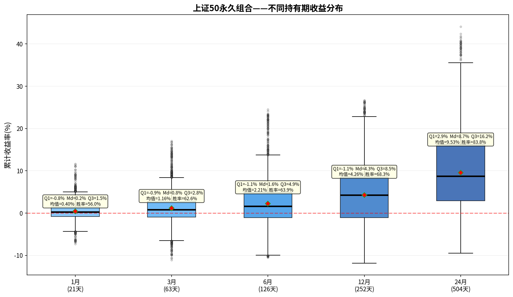

# 上证50永久组合——持有期分析报告

> 初始本金：¥1,000,000  | 资产配置：25%股票+25%债券+25%黄金+25%现金
> 再平衡规则：±8%阈值 + 每年1月强制  |  单次成本：0.1%

---

## 一、收益分布箱线图

上图展示了该永久组合在不同持有期（1/3/6/12/24个月）下的累计收益率分布。
箱体范围 = 25%~75%分位数（Q₁~Q₃），中间横线 = 中位数（Md），红色菱形 = 均值。

---

## 二、各持有期详细统计

### 1月持有期（21个交易日）

| 统计指标 | 数值 |
|---------|------|
| 入场点数 | 3,699 |
| 平均收益 | +0.40% |
| 中位数收益（Md） | +0.24% |
| 下四分位（Q₁） | -0.82% |
| 上四分位（Q₃） | +1.52% |
| 四分位距（IQR=Q₃-Q₁） | 2.34% |
| 标准差 | 2.09% |
| 最佳收益 | +11.62% |
| 最差收益 | -7.33% |
| 收益区间跨度 | 18.95% |
| 胜率（收益>0） | 56.0% |

**解读：** 持有1月，该永久组合的中位数收益为+0.24%，半数入场点收益集中在-0.8%~+1.5%之间。
胜率56.0%，即每100次入场约有56次获得正收益。

### 3月持有期（63个交易日）

| 统计指标 | 数值 |
|---------|------|
| 入场点数 | 3,699 |
| 平均收益 | +1.16% |
| 中位数收益（Md） | +0.82% |
| 下四分位（Q₁） | -0.94% |
| 上四分位（Q₃） | +2.79% |
| 四分位距（IQR=Q₃-Q₁） | 3.73% |
| 标准差 | 3.59% |
| 最佳收益 | +17.08% |
| 最差收益 | -11.14% |
| 收益区间跨度 | 28.22% |
| 胜率（收益>0） | 62.6% |

**解读：** 持有3月，该永久组合的中位数收益为+0.82%，半数入场点收益集中在-0.9%~+2.8%之间。
胜率62.6%，即每100次入场约有62次获得正收益。

### 6月持有期（126个交易日）

| 统计指标 | 数值 |
|---------|------|
| 入场点数 | 3,699 |
| 平均收益 | +2.21% |
| 中位数收益（Md） | +1.62% |
| 下四分位（Q₁） | -1.07% |
| 上四分位（Q₃） | +4.85% |
| 四分位距（IQR=Q₃-Q₁） | 5.92% |
| 标准差 | 5.13% |
| 最佳收益 | +24.54% |
| 最差收益 | -10.53% |
| 收益区间跨度 | 35.07% |
| 胜率（收益>0） | 63.9% |

**解读：** 持有6月，该永久组合的中位数收益为+1.62%，半数入场点收益集中在-1.1%~+4.9%之间。
胜率63.9%，即每100次入场约有63次获得正收益。

### 12月持有期（252个交易日）

| 统计指标 | 数值 |
|---------|------|
| 入场点数 | 3,699 |
| 平均收益 | +4.26% |
| 中位数收益（Md） | +4.25% |
| 下四分位（Q₁） | -1.11% |
| 上四分位（Q₃） | +8.52% |
| 四分位距（IQR=Q₃-Q₁） | 9.64% |
| 标准差 | 6.71% |
| 最佳收益 | +26.71% |
| 最差收益 | -11.84% |
| 收益区间跨度 | 38.55% |
| 胜率（收益>0） | 68.3% |

**解读：** 持有12月，该永久组合的中位数收益为+4.25%，半数入场点收益集中在-1.1%~+8.5%之间。
胜率68.3%，即每100次入场约有68次获得正收益。

### 24月持有期（504个交易日）

| 统计指标 | 数值 |
|---------|------|
| 入场点数 | 3,699 |
| 平均收益 | +9.53% |
| 中位数收益（Md） | +8.73% |
| 下四分位（Q₁） | +2.94% |
| 上四分位（Q₃） | +16.16% |
| 四分位距（IQR=Q₃-Q₁） | 13.22% |
| 标准差 | 9.89% |
| 最佳收益 | +44.11% |
| 最差收益 | -9.47% |
| 收益区间跨度 | 53.59% |
| 胜率（收益>0） | 83.8% |

**解读：** 持有24月，该永久组合的中位数收益为+8.73%，半数入场点收益集中在+2.9%~+16.2%之间。
胜率83.8%，即每100次入场约有83次获得正收益。

---

## 三、持有期对比总结

| 指标 | 1月 | 3月 | 6月 | 12月 | 24月 |
|-----|-----|-----|-----|------|------|
| 平均收益 | +0.40% | +1.16% | +2.21% | +4.26% | +9.53% |
| 中位数收益 | +0.24% | +0.82% | +1.62% | +4.25% | +8.73% |
| 胜率 | 56.0% | 62.6% | 63.9% | 68.3% | 83.8% |
| 四分位距(IQR) | 2.34% | 3.73% | 5.92% | 9.64% | 13.22% |
| 最佳 | +11.62% | +17.08% | +24.54% | +26.71% | +44.11% |
| 最差 | -7.33% | -11.14% | -10.53% | -11.84% | -9.47% |

### 核心观察

1. **胜率趋势**：胜率从1月的56.0%提升至24月的83.8%，呈单调递增。
2. **持有24月收益**：中位数+8.73%，半数入场收益在+2.9%~+16.2%之间。
3. **收益稳定性**：四分位距从1月的2.34%扩大到24月的13.22%，说明持有期越长收益的不确定性也越大。
4. **风险考量**：最差情况为24月亏损9.5%，最佳情况盈利+44.1%。

---

*报告生成时间：2026-06-06*