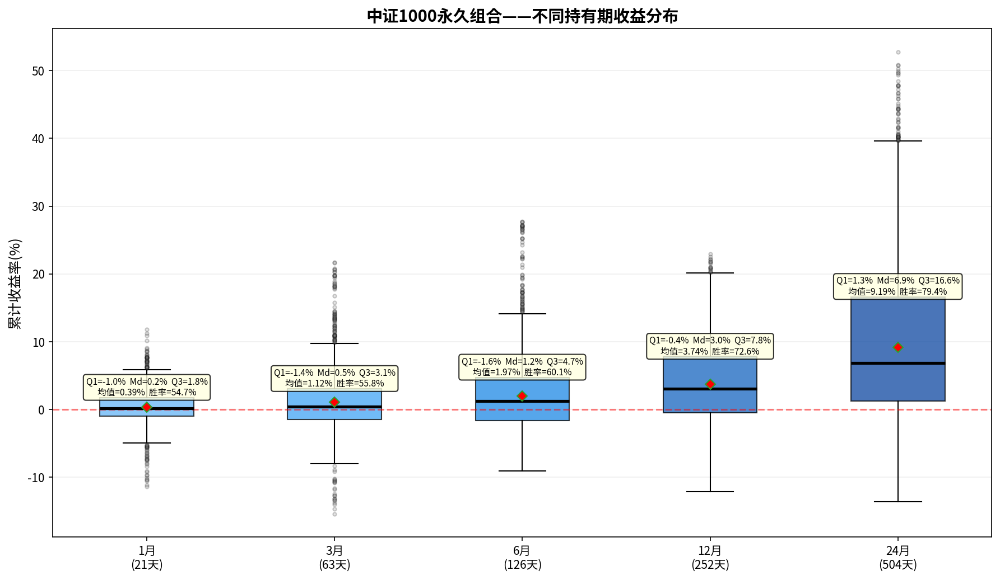

# 中证1000永久组合——持有期分析报告

> 初始本金：¥1,000,000  | 资产配置：25%股票+25%债券+25%黄金+25%现金
> 再平衡规则：±8%阈值 + 每年1月强制  |  单次成本：0.1%

---

## 一、收益分布箱线图

上图展示了该永久组合在不同持有期（1/3/6/12/24个月）下的累计收益率分布。
箱体范围 = 25%~75%分位数（Q₁~Q₃），中间横线 = 中位数（Md），红色菱形 = 均值。

---

## 二、各持有期详细统计

### 1月持有期（21个交易日）

| 统计指标 | 数值 |
|---------|------|
| 入场点数 | 2,301 |
| 平均收益 | +0.39% |
| 中位数收益（Md） | +0.20% |
| 下四分位（Q₁） | -1.00% |
| 上四分位（Q₃） | +1.76% |
| 四分位距（IQR=Q₃-Q₁） | 2.76% |
| 标准差 | 2.44% |
| 最佳收益 | +11.81% |
| 最差收益 | -11.39% |
| 收益区间跨度 | 23.20% |
| 胜率（收益>0） | 54.7% |

**解读：** 持有1月，该永久组合的中位数收益为+0.20%，半数入场点收益集中在-1.0%~+1.8%之间。
胜率54.7%，即每100次入场约有54次获得正收益。

### 3月持有期（63个交易日）

| 统计指标 | 数值 |
|---------|------|
| 入场点数 | 2,301 |
| 平均收益 | +1.12% |
| 中位数收益（Md） | +0.45% |
| 下四分位（Q₁） | -1.44% |
| 上四分位（Q₃） | +3.06% |
| 四分位距（IQR=Q₃-Q₁） | 4.50% |
| 标准差 | 4.25% |
| 最佳收益 | +21.71% |
| 最差收益 | -15.38% |
| 收益区间跨度 | 37.09% |
| 胜率（收益>0） | 55.8% |

**解读：** 持有3月，该永久组合的中位数收益为+0.45%，半数入场点收益集中在-1.4%~+3.1%之间。
胜率55.8%，即每100次入场约有55次获得正收益。

### 6月持有期（126个交易日）

| 统计指标 | 数值 |
|---------|------|
| 入场点数 | 2,301 |
| 平均收益 | +1.97% |
| 中位数收益（Md） | +1.24% |
| 下四分位（Q₁） | -1.60% |
| 上四分位（Q₃） | +4.74% |
| 四分位距（IQR=Q₃-Q₁） | 6.34% |
| 标准差 | 5.42% |
| 最佳收益 | +27.73% |
| 最差收益 | -9.08% |
| 收益区间跨度 | 36.82% |
| 胜率（收益>0） | 60.1% |

**解读：** 持有6月，该永久组合的中位数收益为+1.24%，半数入场点收益集中在-1.6%~+4.7%之间。
胜率60.1%，即每100次入场约有60次获得正收益。

### 12月持有期（252个交易日）

| 统计指标 | 数值 |
|---------|------|
| 入场点数 | 2,301 |
| 平均收益 | +3.74% |
| 中位数收益（Md） | +3.03% |
| 下四分位（Q₁） | -0.44% |
| 上四分位（Q₃） | +7.82% |
| 四分位距（IQR=Q₃-Q₁） | 8.26% |
| 标准差 | 6.56% |
| 最佳收益 | +22.96% |
| 最差收益 | -12.15% |
| 收益区间跨度 | 35.11% |
| 胜率（收益>0） | 72.6% |

**解读：** 持有12月，该永久组合的中位数收益为+3.03%，半数入场点收益集中在-0.4%~+7.8%之间。
胜率72.6%，即每100次入场约有72次获得正收益。

### 24月持有期（504个交易日）

| 统计指标 | 数值 |
|---------|------|
| 入场点数 | 2,301 |
| 平均收益 | +9.19% |
| 中位数收益（Md） | +6.87% |
| 下四分位（Q₁） | +1.27% |
| 上四分位（Q₃） | +16.64% |
| 四分位距（IQR=Q₃-Q₁） | 15.37% |
| 标准差 | 11.79% |
| 最佳收益 | +52.77% |
| 最差收益 | -13.57% |
| 收益区间跨度 | 66.33% |
| 胜率（收益>0） | 79.4% |

**解读：** 持有24月，该永久组合的中位数收益为+6.87%，半数入场点收益集中在+1.3%~+16.6%之间。
胜率79.4%，即每100次入场约有79次获得正收益。

---

## 三、持有期对比总结

| 指标 | 1月 | 3月 | 6月 | 12月 | 24月 |
|-----|-----|-----|-----|------|------|
| 平均收益 | +0.39% | +1.12% | +1.97% | +3.74% | +9.19% |
| 中位数收益 | +0.20% | +0.45% | +1.24% | +3.03% | +6.87% |
| 胜率 | 54.7% | 55.8% | 60.1% | 72.6% | 79.4% |
| 四分位距(IQR) | 2.76% | 4.50% | 6.34% | 8.26% | 15.37% |
| 最佳 | +11.81% | +21.71% | +27.73% | +22.96% | +52.77% |
| 最差 | -11.39% | -15.38% | -9.08% | -12.15% | -13.57% |

### 核心观察

1. **胜率趋势**：胜率从1月的54.7%提升至24月的79.4%，呈单调递增。
2. **持有24月收益**：中位数+6.87%，半数入场收益在+1.3%~+16.6%之间。
3. **收益稳定性**：四分位距从1月的2.76%扩大到24月的15.37%，说明持有期越长收益的不确定性也越大。
4. **风险考量**：最差情况为24月亏损13.6%，最佳情况盈利+52.8%。

---

*报告生成时间：2026-06-06*