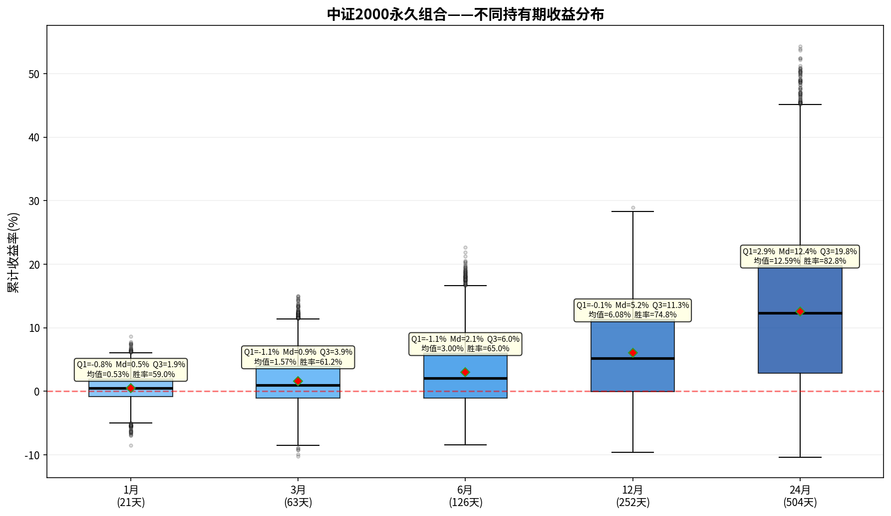

# 中证2000永久组合——持有期分析报告

> 初始本金：¥1,000,000  | 资产配置：25%股票+25%债券+25%黄金+25%现金
> 再平衡规则：±8%阈值 + 每年1月强制  |  单次成本：0.1%

---

## 一、收益分布箱线图

上图展示了该永久组合在不同持有期（1/3/6/12/24个月）下的累计收益率分布。
箱体范围 = 25%~75%分位数（Q₁~Q₃），中间横线 = 中位数（Md），红色菱形 = 均值。

---

## 二、各持有期详细统计

### 1月持有期（21个交易日）

| 统计指标 | 数值 |
|---------|------|
| 入场点数 | 3,579 |
| 平均收益 | +0.53% |
| 中位数收益（Md） | +0.48% |
| 下四分位（Q₁） | -0.83% |
| 上四分位（Q₃） | +1.95% |
| 四分位距（IQR=Q₃-Q₁） | 2.77% |
| 标准差 | 2.18% |
| 最佳收益 | +8.66% |
| 最差收益 | -8.53% |
| 收益区间跨度 | 17.19% |
| 胜率（收益>0） | 59.0% |

**解读：** 持有1月，该永久组合的中位数收益为+0.48%，半数入场点收益集中在-0.8%~+1.9%之间。
胜率59.0%，即每100次入场约有59次获得正收益。

### 3月持有期（63个交易日）

| 统计指标 | 数值 |
|---------|------|
| 入场点数 | 3,579 |
| 平均收益 | +1.57% |
| 中位数收益（Md） | +0.94% |
| 下四分位（Q₁） | -1.08% |
| 上四分位（Q₃） | +3.92% |
| 四分位距（IQR=Q₃-Q₁） | 4.99% |
| 标准差 | 3.90% |
| 最佳收益 | +14.99% |
| 最差收益 | -10.26% |
| 收益区间跨度 | 25.25% |
| 胜率（收益>0） | 61.2% |

**解读：** 持有3月，该永久组合的中位数收益为+0.94%，半数入场点收益集中在-1.1%~+3.9%之间。
胜率61.2%，即每100次入场约有61次获得正收益。

### 6月持有期（126个交易日）

| 统计指标 | 数值 |
|---------|------|
| 入场点数 | 3,579 |
| 平均收益 | +3.00% |
| 中位数收益（Md） | +2.07% |
| 下四分位（Q₁） | -1.07% |
| 上四分位（Q₃） | +6.00% |
| 四分位距（IQR=Q₃-Q₁） | 7.07% |
| 标准差 | 5.53% |
| 最佳收益 | +22.66% |
| 最差收益 | -8.43% |
| 收益区间跨度 | 31.09% |
| 胜率（收益>0） | 65.0% |

**解读：** 持有6月，该永久组合的中位数收益为+2.07%，半数入场点收益集中在-1.1%~+6.0%之间。
胜率65.0%，即每100次入场约有65次获得正收益。

### 12月持有期（252个交易日）

| 统计指标 | 数值 |
|---------|------|
| 入场点数 | 3,579 |
| 平均收益 | +6.08% |
| 中位数收益（Md） | +5.23% |
| 下四分位（Q₁） | -0.05% |
| 上四分位（Q₃） | +11.31% |
| 四分位距（IQR=Q₃-Q₁） | 11.36% |
| 标准差 | 7.89% |
| 最佳收益 | +28.94% |
| 最差收益 | -9.63% |
| 收益区间跨度 | 38.56% |
| 胜率（收益>0） | 74.8% |

**解读：** 持有12月，该永久组合的中位数收益为+5.23%，半数入场点收益集中在-0.1%~+11.3%之间。
胜率74.8%，即每100次入场约有74次获得正收益。

### 24月持有期（504个交易日）

| 统计指标 | 数值 |
|---------|------|
| 入场点数 | 3,579 |
| 平均收益 | +12.59% |
| 中位数收益（Md） | +12.37% |
| 下四分位（Q₁） | +2.88% |
| 上四分位（Q₃） | +19.78% |
| 四分位距（IQR=Q₃-Q₁） | 16.89% |
| 标准差 | 12.42% |
| 最佳收益 | +54.33% |
| 最差收益 | -10.36% |
| 收益区间跨度 | 64.70% |
| 胜率（收益>0） | 82.8% |

**解读：** 持有24月，该永久组合的中位数收益为+12.37%，半数入场点收益集中在+2.9%~+19.8%之间。
胜率82.8%，即每100次入场约有82次获得正收益。

---

## 三、持有期对比总结

| 指标 | 1月 | 3月 | 6月 | 12月 | 24月 |
|-----|-----|-----|-----|------|------|
| 平均收益 | +0.53% | +1.57% | +3.00% | +6.08% | +12.59% |
| 中位数收益 | +0.48% | +0.94% | +2.07% | +5.23% | +12.37% |
| 胜率 | 59.0% | 61.2% | 65.0% | 74.8% | 82.8% |
| 四分位距(IQR) | 2.77% | 4.99% | 7.07% | 11.36% | 16.89% |
| 最佳 | +8.66% | +14.99% | +22.66% | +28.94% | +54.33% |
| 最差 | -8.53% | -10.26% | -8.43% | -9.63% | -10.36% |

### 核心观察

1. **胜率趋势**：胜率从1月的59.0%提升至24月的82.8%，呈单调递增。
2. **持有24月收益**：中位数+12.37%，半数入场收益在+2.9%~+19.8%之间。
3. **收益稳定性**：四分位距从1月的2.77%扩大到24月的16.89%，说明持有期越长收益的不确定性也越大。
4. **风险考量**：最差情况为24月亏损10.4%，最佳情况盈利+54.3%。

---

*报告生成时间：2026-06-06*