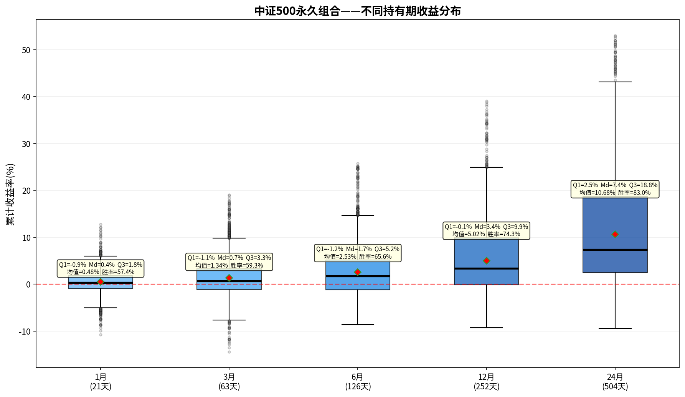

# 中证500永久组合——持有期分析报告

> 初始本金：¥1,000,000  | 资产配置：25%股票+25%债券+25%黄金+25%现金
> 再平衡规则：±8%阈值 + 每年1月强制  |  单次成本：0.1%

---

## 一、收益分布箱线图

上图展示了该永久组合在不同持有期（1/3/6/12/24个月）下的累计收益率分布。
箱体范围 = 25%~75%分位数（Q₁~Q₃），中间横线 = 中位数（Md），红色菱形 = 均值。

---

## 二、各持有期详细统计

### 1月持有期（21个交易日）

| 统计指标 | 数值 |
|---------|------|
| 入场点数 | 3,699 |
| 平均收益 | +0.48% |
| 中位数收益（Md） | +0.36% |
| 下四分位（Q₁） | -0.92% |
| 上四分位（Q₃） | +1.85% |
| 四分位距（IQR=Q₃-Q₁） | 2.76% |
| 标准差 | 2.36% |
| 最佳收益 | +12.80% |
| 最差收益 | -10.78% |
| 收益区间跨度 | 23.58% |
| 胜率（收益>0） | 57.4% |

**解读：** 持有1月，该永久组合的中位数收益为+0.36%，半数入场点收益集中在-0.9%~+1.8%之间。
胜率57.4%，即每100次入场约有57次获得正收益。

### 3月持有期（63个交易日）

| 统计指标 | 数值 |
|---------|------|
| 入场点数 | 3,699 |
| 平均收益 | +1.34% |
| 中位数收益（Md） | +0.72% |
| 下四分位（Q₁） | -1.09% |
| 上四分位（Q₃） | +3.27% |
| 四分位距（IQR=Q₃-Q₁） | 4.36% |
| 标准差 | 3.88% |
| 最佳收益 | +19.09% |
| 最差收益 | -14.39% |
| 收益区间跨度 | 33.48% |
| 胜率（收益>0） | 59.3% |

**解读：** 持有3月，该永久组合的中位数收益为+0.72%，半数入场点收益集中在-1.1%~+3.3%之间。
胜率59.3%，即每100次入场约有59次获得正收益。

### 6月持有期（126个交易日）

| 统计指标 | 数值 |
|---------|------|
| 入场点数 | 3,699 |
| 平均收益 | +2.53% |
| 中位数收益（Md） | +1.72% |
| 下四分位（Q₁） | -1.18% |
| 上四分位（Q₃） | +5.15% |
| 四分位距（IQR=Q₃-Q₁） | 6.33% |
| 标准差 | 5.24% |
| 最佳收益 | +25.74% |
| 最差收益 | -8.61% |
| 收益区间跨度 | 34.35% |
| 胜率（收益>0） | 65.6% |

**解读：** 持有6月，该永久组合的中位数收益为+1.72%，半数入场点收益集中在-1.2%~+5.2%之间。
胜率65.6%，即每100次入场约有65次获得正收益。

### 12月持有期（252个交易日）

| 统计指标 | 数值 |
|---------|------|
| 入场点数 | 3,699 |
| 平均收益 | +5.02% |
| 中位数收益（Md） | +3.36% |
| 下四分位（Q₁） | -0.09% |
| 上四分位（Q₃） | +9.92% |
| 四分位距（IQR=Q₃-Q₁） | 10.01% |
| 标准差 | 7.59% |
| 最佳收益 | +39.03% |
| 最差收益 | -9.25% |
| 收益区间跨度 | 48.29% |
| 胜率（收益>0） | 74.3% |

**解读：** 持有12月，该永久组合的中位数收益为+3.36%，半数入场点收益集中在-0.1%~+9.9%之间。
胜率74.3%，即每100次入场约有74次获得正收益。

### 24月持有期（504个交易日）

| 统计指标 | 数值 |
|---------|------|
| 入场点数 | 3,699 |
| 平均收益 | +10.68% |
| 中位数收益（Md） | +7.38% |
| 下四分位（Q₁） | +2.45% |
| 上四分位（Q₃） | +18.77% |
| 四分位距（IQR=Q₃-Q₁） | 16.31% |
| 标准差 | 11.82% |
| 最佳收益 | +53.05% |
| 最差收益 | -9.44% |
| 收益区间跨度 | 62.49% |
| 胜率（收益>0） | 83.0% |

**解读：** 持有24月，该永久组合的中位数收益为+7.38%，半数入场点收益集中在+2.5%~+18.8%之间。
胜率83.0%，即每100次入场约有82次获得正收益。

---

## 三、持有期对比总结

| 指标 | 1月 | 3月 | 6月 | 12月 | 24月 |
|-----|-----|-----|-----|------|------|
| 平均收益 | +0.48% | +1.34% | +2.53% | +5.02% | +10.68% |
| 中位数收益 | +0.36% | +0.72% | +1.72% | +3.36% | +7.38% |
| 胜率 | 57.4% | 59.3% | 65.6% | 74.3% | 83.0% |
| 四分位距(IQR) | 2.76% | 4.36% | 6.33% | 10.01% | 16.31% |
| 最佳 | +12.80% | +19.09% | +25.74% | +39.03% | +53.05% |
| 最差 | -10.78% | -14.39% | -8.61% | -9.25% | -9.44% |

### 核心观察

1. **胜率趋势**：胜率从1月的57.4%提升至24月的83.0%，呈单调递增。
2. **持有24月收益**：中位数+7.38%，半数入场收益在+2.5%~+18.8%之间。
3. **收益稳定性**：四分位距从1月的2.76%扩大到24月的16.31%，说明持有期越长收益的不确定性也越大。
4. **风险考量**：最差情况为24月亏损9.4%，最佳情况盈利+53.1%。

---

*报告生成时间：2026-06-06*