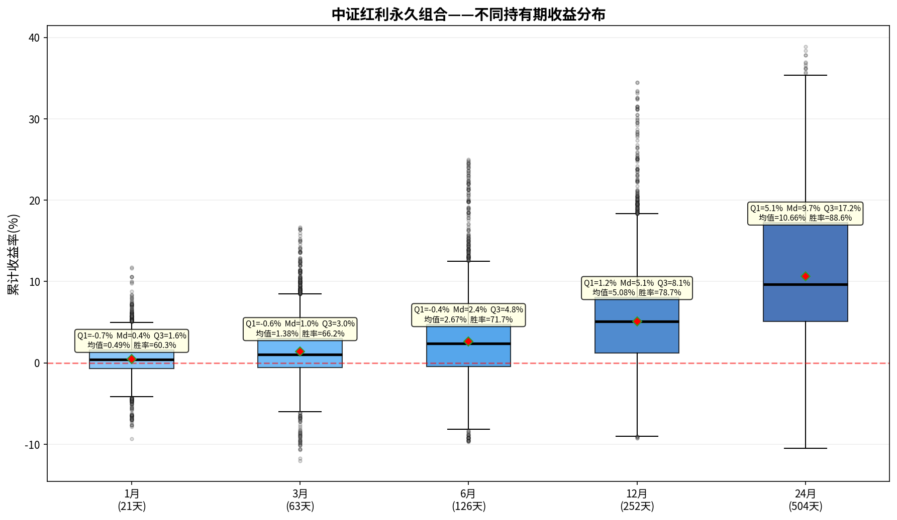

# 中证红利永久组合——持有期分析报告

> 初始本金：¥1,000,000  | 资产配置：25%股票+25%债券+25%黄金+25%现金
> 再平衡规则：±8%阈值 + 每年1月强制  |  单次成本：0.1%

---

## 一、收益分布箱线图

上图展示了该永久组合在不同持有期（1/3/6/12/24个月）下的累计收益率分布。
箱体范围 = 25%~75%分位数（Q₁~Q₃），中间横线 = 中位数（Md），红色菱形 = 均值。

---

## 二、各持有期详细统计

### 1月持有期（21个交易日）

| 统计指标 | 数值 |
|---------|------|
| 入场点数 | 3,699 |
| 平均收益 | +0.49% |
| 中位数收益（Md） | +0.43% |
| 下四分位（Q₁） | -0.71% |
| 上四分位（Q₃） | +1.58% |
| 四分位距（IQR=Q₃-Q₁） | 2.29% |
| 标准差 | 2.11% |
| 最佳收益 | +11.74% |
| 最差收益 | -9.32% |
| 收益区间跨度 | 21.06% |
| 胜率（收益>0） | 60.3% |

**解读：** 持有1月，该永久组合的中位数收益为+0.43%，半数入场点收益集中在-0.7%~+1.6%之间。
胜率60.3%，即每100次入场约有60次获得正收益。

### 3月持有期（63个交易日）

| 统计指标 | 数值 |
|---------|------|
| 入场点数 | 3,699 |
| 平均收益 | +1.38% |
| 中位数收益（Md） | +1.04% |
| 下四分位（Q₁） | -0.60% |
| 上四分位（Q₃） | +3.03% |
| 四分位距（IQR=Q₃-Q₁） | 3.63% |
| 标准差 | 3.51% |
| 最佳收益 | +16.69% |
| 最差收益 | -12.01% |
| 收益区间跨度 | 28.70% |
| 胜率（收益>0） | 66.2% |

**解读：** 持有3月，该永久组合的中位数收益为+1.04%，半数入场点收益集中在-0.6%~+3.0%之间。
胜率66.2%，即每100次入场约有66次获得正收益。

### 6月持有期（126个交易日）

| 统计指标 | 数值 |
|---------|------|
| 入场点数 | 3,699 |
| 平均收益 | +2.67% |
| 中位数收益（Md） | +2.39% |
| 下四分位（Q₁） | -0.44% |
| 上四分位（Q₃） | +4.75% |
| 四分位距（IQR=Q₃-Q₁） | 5.19% |
| 标准差 | 4.98% |
| 最佳收益 | +25.01% |
| 最差收益 | -9.69% |
| 收益区间跨度 | 34.70% |
| 胜率（收益>0） | 71.7% |

**解读：** 持有6月，该永久组合的中位数收益为+2.39%，半数入场点收益集中在-0.4%~+4.8%之间。
胜率71.7%，即每100次入场约有71次获得正收益。

### 12月持有期（252个交易日）

| 统计指标 | 数值 |
|---------|------|
| 入场点数 | 3,699 |
| 平均收益 | +5.08% |
| 中位数收益（Md） | +5.11% |
| 下四分位（Q₁） | +1.24% |
| 上四分位（Q₃） | +8.07% |
| 四分位距（IQR=Q₃-Q₁） | 6.83% |
| 标准差 | 6.55% |
| 最佳收益 | +34.47% |
| 最差收益 | -9.26% |
| 收益区间跨度 | 43.73% |
| 胜率（收益>0） | 78.7% |

**解读：** 持有12月，该永久组合的中位数收益为+5.11%，半数入场点收益集中在+1.2%~+8.1%之间。
胜率78.7%，即每100次入场约有78次获得正收益。

### 24月持有期（504个交易日）

| 统计指标 | 数值 |
|---------|------|
| 入场点数 | 3,699 |
| 平均收益 | +10.66% |
| 中位数收益（Md） | +9.67% |
| 下四分位（Q₁） | +5.07% |
| 上四分位（Q₃） | +17.23% |
| 四分位距（IQR=Q₃-Q₁） | 12.16% |
| 标准差 | 9.29% |
| 最佳收益 | +38.89% |
| 最差收益 | -10.48% |
| 收益区间跨度 | 49.37% |
| 胜率（收益>0） | 88.6% |

**解读：** 持有24月，该永久组合的中位数收益为+9.67%，半数入场点收益集中在+5.1%~+17.2%之间。
胜率88.6%，即每100次入场约有88次获得正收益。

---

## 三、持有期对比总结

| 指标 | 1月 | 3月 | 6月 | 12月 | 24月 |
|-----|-----|-----|-----|------|------|
| 平均收益 | +0.49% | +1.38% | +2.67% | +5.08% | +10.66% |
| 中位数收益 | +0.43% | +1.04% | +2.39% | +5.11% | +9.67% |
| 胜率 | 60.3% | 66.2% | 71.7% | 78.7% | 88.6% |
| 四分位距(IQR) | 2.29% | 3.63% | 5.19% | 6.83% | 12.16% |
| 最佳 | +11.74% | +16.69% | +25.01% | +34.47% | +38.89% |
| 最差 | -9.32% | -12.01% | -9.69% | -9.26% | -10.48% |

### 核心观察

1. **胜率趋势**：胜率从1月的60.3%提升至24月的88.6%，呈单调递增。
2. **持有24月收益**：中位数+9.67%，半数入场收益在+5.1%~+17.2%之间。
3. **收益稳定性**：四分位距从1月的2.29%扩大到24月的12.16%，说明持有期越长收益的不确定性也越大。
4. **风险考量**：最差情况为24月亏损10.5%，最佳情况盈利+38.9%。

---

*报告生成时间：2026-06-06*