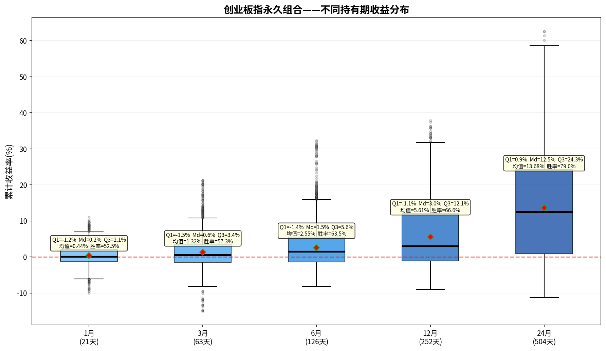

# 创业板指永久组合——持有期分析报告

> 初始本金：¥1,000,000  | 资产配置：25%股票+25%债券+25%黄金+25%现金
> 再平衡规则：±8%阈值 + 每年1月强制  |  单次成本：0.1%

---

## 一、收益分布箱线图

上图展示了该永久组合在不同持有期（1/3/6/12/24个月）下的累计收益率分布。
箱体范围 = 25%~75%分位数（Q₁~Q₃），中间横线 = 中位数（Md），红色菱形 = 均值。

---

## 二、各持有期详细统计

### 1月持有期（21个交易日）

| 统计指标 | 数值 |
|---------|------|
| 入场点数 | 3,355 |
| 平均收益 | +0.44% |
| 中位数收益（Md） | +0.16% |
| 下四分位（Q₁） | -1.20% |
| 上四分位（Q₃） | +2.09% |
| 四分位距（IQR=Q₃-Q₁） | 3.28% |
| 标准差 | 2.60% |
| 最佳收益 | +11.15% |
| 最差收益 | -10.01% |
| 收益区间跨度 | 21.16% |
| 胜率（收益>0） | 52.5% |

**解读：** 持有1月，该永久组合的中位数收益为+0.16%，半数入场点收益集中在-1.2%~+2.1%之间。
胜率52.5%，即每100次入场约有52次获得正收益。

### 3月持有期（63个交易日）

| 统计指标 | 数值 |
|---------|------|
| 入场点数 | 3,355 |
| 平均收益 | +1.32% |
| 中位数收益（Md） | +0.62% |
| 下四分位（Q₁） | -1.50% |
| 上四分位（Q₃） | +3.43% |
| 四分位距（IQR=Q₃-Q₁） | 4.93% |
| 标准差 | 4.35% |
| 最佳收益 | +21.24% |
| 最差收益 | -14.97% |
| 收益区间跨度 | 36.22% |
| 胜率（收益>0） | 57.3% |

**解读：** 持有3月，该永久组合的中位数收益为+0.62%，半数入场点收益集中在-1.5%~+3.4%之间。
胜率57.3%，即每100次入场约有57次获得正收益。

### 6月持有期（126个交易日）

| 统计指标 | 数值 |
|---------|------|
| 入场点数 | 3,355 |
| 平均收益 | +2.55% |
| 中位数收益（Md） | +1.55% |
| 下四分位（Q₁） | -1.35% |
| 上四分位（Q₃） | +5.57% |
| 四分位距（IQR=Q₃-Q₁） | 6.93% |
| 标准差 | 5.71% |
| 最佳收益 | +32.35% |
| 最差收益 | -8.17% |
| 收益区间跨度 | 40.52% |
| 胜率（收益>0） | 63.5% |

**解读：** 持有6月，该永久组合的中位数收益为+1.55%，半数入场点收益集中在-1.4%~+5.6%之间。
胜率63.5%，即每100次入场约有63次获得正收益。

### 12月持有期（252个交易日）

| 统计指标 | 数值 |
|---------|------|
| 入场点数 | 3,355 |
| 平均收益 | +5.61% |
| 中位数收益（Md） | +3.04% |
| 下四分位（Q₁） | -1.06% |
| 上四分位（Q₃） | +12.09% |
| 四分位距（IQR=Q₃-Q₁） | 13.15% |
| 标准差 | 8.74% |
| 最佳收益 | +37.87% |
| 最差收益 | -8.95% |
| 收益区间跨度 | 46.83% |
| 胜率（收益>0） | 66.6% |

**解读：** 持有12月，该永久组合的中位数收益为+3.04%，半数入场点收益集中在-1.1%~+12.1%之间。
胜率66.6%，即每100次入场约有66次获得正收益。

### 24月持有期（504个交易日）

| 统计指标 | 数值 |
|---------|------|
| 入场点数 | 3,355 |
| 平均收益 | +13.68% |
| 中位数收益（Md） | +12.50% |
| 下四分位（Q₁） | +0.85% |
| 上四分位（Q₃） | +24.30% |
| 四分位距（IQR=Q₃-Q₁） | 23.44% |
| 标准差 | 14.90% |
| 最佳收益 | +62.61% |
| 最差收益 | -11.27% |
| 收益区间跨度 | 73.88% |
| 胜率（收益>0） | 79.0% |

**解读：** 持有24月，该永久组合的中位数收益为+12.50%，半数入场点收益集中在+0.9%~+24.3%之间。
胜率79.0%，即每100次入场约有79次获得正收益。

---

## 三、持有期对比总结

| 指标 | 1月 | 3月 | 6月 | 12月 | 24月 |
|-----|-----|-----|-----|------|------|
| 平均收益 | +0.44% | +1.32% | +2.55% | +5.61% | +13.68% |
| 中位数收益 | +0.16% | +0.62% | +1.55% | +3.04% | +12.50% |
| 胜率 | 52.5% | 57.3% | 63.5% | 66.6% | 79.0% |
| 四分位距(IQR) | 3.28% | 4.93% | 6.93% | 13.15% | 23.44% |
| 最佳 | +11.15% | +21.24% | +32.35% | +37.87% | +62.61% |
| 最差 | -10.01% | -14.97% | -8.17% | -8.95% | -11.27% |

### 核心观察

1. **胜率趋势**：胜率从1月的52.5%提升至24月的79.0%，呈单调递增。
2. **持有24月收益**：中位数+12.50%，半数入场收益在+0.9%~+24.3%之间。
3. **收益稳定性**：四分位距从1月的3.28%扩大到24月的23.44%，说明持有期越长收益的不确定性也越大。
4. **风险考量**：最差情况为24月亏损11.3%，最佳情况盈利+62.6%。

---

*报告生成时间：2026-06-06*