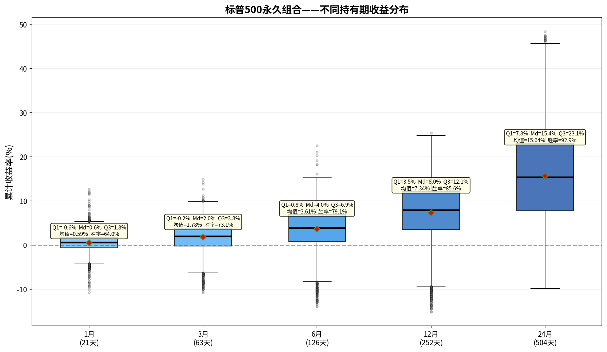

# 标普500永久组合——持有期分析报告

> 初始本金：$100,000  | 资产配置：25%股票+25%债券+25%黄金+25%现金
> 再平衡规则：±8%阈值 + 每年1月强制  |  单次成本：0.1%

---

## 一、收益分布箱线图

上图展示了该永久组合在不同持有期（1/3/6/12/24个月）下的累计收益率分布。
箱体范围 = 25%~75%分位数（Q₁~Q₃），中间横线 = 中位数（Md），红色菱形 = 均值。

---

## 二、各持有期详细统计

### 1月持有期（21个交易日）

| 统计指标 | 数值 |
|---------|------|
| 入场点数 | 5,393 |
| 平均收益 | +0.59% |
| 中位数收益（Md） | +0.61% |
| 下四分位（Q₁） | -0.58% |
| 上四分位（Q₃） | +1.79% |
| 四分位距（IQR=Q₃-Q₁） | 2.37% |
| 标准差 | 2.02% |
| 最佳收益 | +12.75% |
| 最差收益 | -10.75% |
| 收益区间跨度 | 23.49% |
| 胜率（收益>0） | 64.0% |

**解读：** 持有1月，该永久组合的中位数收益为+0.61%，半数入场点收益集中在-0.6%~+1.8%之间。
胜率64.0%，即每100次入场约有63次获得正收益。

### 3月持有期（63个交易日）

| 统计指标 | 数值 |
|---------|------|
| 入场点数 | 5,393 |
| 平均收益 | +1.78% |
| 中位数收益（Md） | +2.00% |
| 下四分位（Q₁） | -0.21% |
| 上四分位（Q₃） | +3.85% |
| 四分位距（IQR=Q₃-Q₁） | 4.06% |
| 标准差 | 3.24% |
| 最佳收益 | +14.93% |
| 最差收益 | -10.78% |
| 收益区间跨度 | 25.71% |
| 胜率（收益>0） | 73.1% |

**解读：** 持有3月，该永久组合的中位数收益为+2.00%，半数入场点收益集中在-0.2%~+3.8%之间。
胜率73.1%，即每100次入场约有73次获得正收益。

### 6月持有期（126个交易日）

| 统计指标 | 数值 |
|---------|------|
| 入场点数 | 5,393 |
| 平均收益 | +3.61% |
| 中位数收益（Md） | +3.96% |
| 下四分位（Q₁） | +0.81% |
| 上四分位（Q₃） | +6.90% |
| 四分位距（IQR=Q₃-Q₁） | 6.09% |
| 标准差 | 4.70% |
| 最佳收益 | +22.59% |
| 最差收益 | -14.03% |
| 收益区间跨度 | 36.62% |
| 胜率（收益>0） | 79.1% |

**解读：** 持有6月，该永久组合的中位数收益为+3.96%，半数入场点收益集中在+0.8%~+6.9%之间。
胜率79.1%，即每100次入场约有79次获得正收益。

### 12月持有期（252个交易日）

| 统计指标 | 数值 |
|---------|------|
| 入场点数 | 5,393 |
| 平均收益 | +7.34% |
| 中位数收益（Md） | +7.97% |
| 下四分位（Q₁） | +3.54% |
| 上四分位（Q₃） | +12.15% |
| 四分位距（IQR=Q₃-Q₁） | 8.61% |
| 标准差 | 6.70% |
| 最佳收益 | +25.39% |
| 最差收益 | -15.13% |
| 收益区间跨度 | 40.52% |
| 胜率（收益>0） | 85.6% |

**解读：** 持有12月，该永久组合的中位数收益为+7.97%，半数入场点收益集中在+3.5%~+12.1%之间。
胜率85.6%，即每100次入场约有85次获得正收益。

### 24月持有期（504个交易日）

| 统计指标 | 数值 |
|---------|------|
| 入场点数 | 5,393 |
| 平均收益 | +15.64% |
| 中位数收益（Md） | +15.43% |
| 下四分位（Q₁） | +7.79% |
| 上四分位（Q₃） | +23.06% |
| 四分位距（IQR=Q₃-Q₁） | 15.27% |
| 标准差 | 10.71% |
| 最佳收益 | +48.45% |
| 最差收益 | -9.81% |
| 收益区间跨度 | 58.27% |
| 胜率（收益>0） | 92.9% |

**解读：** 持有24月，该永久组合的中位数收益为+15.43%，半数入场点收益集中在+7.8%~+23.1%之间。
胜率92.9%，即每100次入场约有92次获得正收益。

---

## 三、持有期对比总结

| 指标 | 1月 | 3月 | 6月 | 12月 | 24月 |
|-----|-----|-----|-----|------|------|
| 平均收益 | +0.59% | +1.78% | +3.61% | +7.34% | +15.64% |
| 中位数收益 | +0.61% | +2.00% | +3.96% | +7.97% | +15.43% |
| 胜率 | 64.0% | 73.1% | 79.1% | 85.6% | 92.9% |
| 四分位距(IQR) | 2.37% | 4.06% | 6.09% | 8.61% | 15.27% |
| 最佳 | +12.75% | +14.93% | +22.59% | +25.39% | +48.45% |
| 最差 | -10.75% | -10.78% | -14.03% | -15.13% | -9.81% |

### 核心观察

1. **胜率趋势**：胜率从1月的64.0%提升至24月的92.9%，呈单调递增。
2. **持有24月收益**：中位数+15.43%，半数入场收益在+7.8%~+23.1%之间。
3. **收益稳定性**：四分位距从1月的2.37%扩大到24月的15.27%，说明持有期越长收益的不确定性也越大。
4. **风险考量**：最差情况为24月亏损9.8%，最佳情况盈利+48.5%。

---

*报告生成时间：2026-06-06*