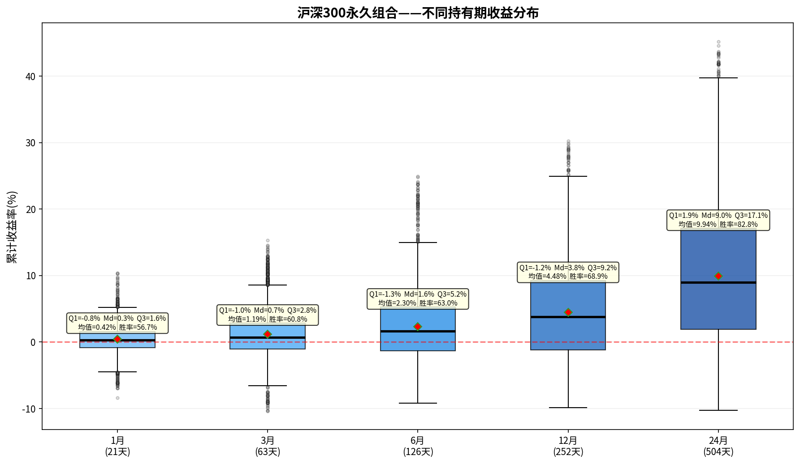

# 沪深300永久组合——持有期分析报告

> 初始本金：¥1,000,000  | 资产配置：25%股票+25%债券+25%黄金+25%现金
> 再平衡规则：±8%阈值 + 每年1月强制  |  单次成本：0.1%

---

## 一、收益分布箱线图

上图展示了该永久组合在不同持有期（1/3/6/12/24个月）下的累计收益率分布。
箱体范围 = 25%~75%分位数（Q₁~Q₃），中间横线 = 中位数（Md），红色菱形 = 均值。

---

## 二、各持有期详细统计

### 1月持有期（21个交易日）

| 统计指标 | 数值 |
|---------|------|
| 入场点数 | 3,715 |
| 平均收益 | +0.42% |
| 中位数收益（Md） | +0.29% |
| 下四分位（Q₁） | -0.83% |
| 上四分位（Q₃） | +1.60% |
| 四分位距（IQR=Q₃-Q₁） | 2.43% |
| 标准差 | 2.09% |
| 最佳收益 | +10.38% |
| 最差收益 | -8.42% |
| 收益区间跨度 | 18.81% |
| 胜率（收益>0） | 56.7% |

**解读：** 持有1月，该永久组合的中位数收益为+0.29%，半数入场点收益集中在-0.8%~+1.6%之间。
胜率56.7%，即每100次入场约有56次获得正收益。

### 3月持有期（63个交易日）

| 统计指标 | 数值 |
|---------|------|
| 入场点数 | 3,715 |
| 平均收益 | +1.19% |
| 中位数收益（Md） | +0.69% |
| 下四分位（Q₁） | -1.02% |
| 上四分位（Q₃） | +2.82% |
| 四分位距（IQR=Q₃-Q₁） | 3.84% |
| 标准差 | 3.61% |
| 最佳收益 | +15.29% |
| 最差收益 | -10.39% |
| 收益区间跨度 | 25.68% |
| 胜率（收益>0） | 60.8% |

**解读：** 持有3月，该永久组合的中位数收益为+0.69%，半数入场点收益集中在-1.0%~+2.8%之间。
胜率60.8%，即每100次入场约有60次获得正收益。

### 6月持有期（126个交易日）

| 统计指标 | 数值 |
|---------|------|
| 入场点数 | 3,715 |
| 平均收益 | +2.30% |
| 中位数收益（Md） | +1.64% |
| 下四分位（Q₁） | -1.30% |
| 上四分位（Q₃） | +5.24% |
| 四分位距（IQR=Q₃-Q₁） | 6.54% |
| 标准差 | 5.18% |
| 最佳收益 | +24.91% |
| 最差收益 | -9.17% |
| 收益区间跨度 | 34.08% |
| 胜率（收益>0） | 63.0% |

**解读：** 持有6月，该永久组合的中位数收益为+1.64%，半数入场点收益集中在-1.3%~+5.2%之间。
胜率63.0%，即每100次入场约有62次获得正收益。

### 12月持有期（252个交易日）

| 统计指标 | 数值 |
|---------|------|
| 入场点数 | 3,715 |
| 平均收益 | +4.48% |
| 中位数收益（Md） | +3.82% |
| 下四分位（Q₁） | -1.21% |
| 上四分位（Q₃） | +9.24% |
| 四分位距（IQR=Q₃-Q₁） | 10.45% |
| 标准差 | 6.99% |
| 最佳收益 | +30.24% |
| 最差收益 | -9.84% |
| 收益区间跨度 | 40.08% |
| 胜率（收益>0） | 68.9% |

**解读：** 持有12月，该永久组合的中位数收益为+3.82%，半数入场点收益集中在-1.2%~+9.2%之间。
胜率68.9%，即每100次入场约有68次获得正收益。

### 24月持有期（504个交易日）

| 统计指标 | 数值 |
|---------|------|
| 入场点数 | 3,715 |
| 平均收益 | +9.94% |
| 中位数收益（Md） | +9.00% |
| 下四分位（Q₁） | +1.93% |
| 上四分位（Q₃） | +17.08% |
| 四分位距（IQR=Q₃-Q₁） | 15.15% |
| 标准差 | 10.55% |
| 最佳收益 | +45.20% |
| 最差收益 | -10.29% |
| 收益区间跨度 | 55.49% |
| 胜率（收益>0） | 82.8% |

**解读：** 持有24月，该永久组合的中位数收益为+9.00%，半数入场点收益集中在+1.9%~+17.1%之间。
胜率82.8%，即每100次入场约有82次获得正收益。

---

## 三、持有期对比总结

| 指标 | 1月 | 3月 | 6月 | 12月 | 24月 |
|-----|-----|-----|-----|------|------|
| 平均收益 | +0.42% | +1.19% | +2.30% | +4.48% | +9.94% |
| 中位数收益 | +0.29% | +0.69% | +1.64% | +3.82% | +9.00% |
| 胜率 | 56.7% | 60.8% | 63.0% | 68.9% | 82.8% |
| 四分位距(IQR) | 2.43% | 3.84% | 6.54% | 10.45% | 15.15% |
| 最佳 | +10.38% | +15.29% | +24.91% | +30.24% | +45.20% |
| 最差 | -8.42% | -10.39% | -9.17% | -9.84% | -10.29% |

### 核心观察

1. **胜率趋势**：胜率从1月的56.7%提升至24月的82.8%，呈单调递增。
2. **持有24月收益**：中位数+9.00%，半数入场收益在+1.9%~+17.1%之间。
3. **收益稳定性**：四分位距从1月的2.43%扩大到24月的15.15%，说明持有期越长收益的不确定性也越大。
4. **风险考量**：最差情况为24月亏损10.3%，最佳情况盈利+45.2%。

---

*报告生成时间：2026-06-06*