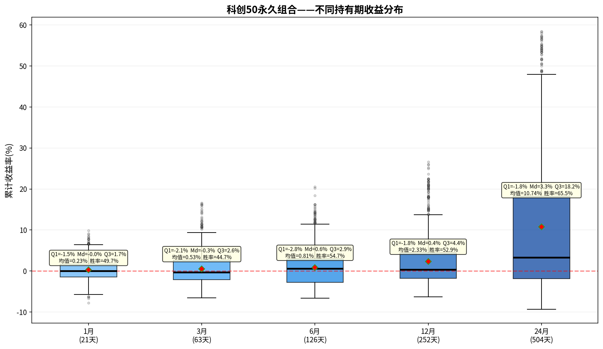

# 科创50永久组合——持有期分析报告

> 初始本金：¥1,000,000  | 资产配置：25%股票+25%债券+25%黄金+25%现金
> 再平衡规则：±8%阈值 + 每年1月强制  |  单次成本：0.1%

---

## 一、收益分布箱线图

上图展示了该永久组合在不同持有期（1/3/6/12/24个月）下的累计收益率分布。
箱体范围 = 25%~75%分位数（Q₁~Q₃），中间横线 = 中位数（Md），红色菱形 = 均值。

---

## 二、各持有期详细统计

### 1月持有期（21个交易日）

| 统计指标 | 数值 |
|---------|------|
| 入场点数 | 1,029 |
| 平均收益 | +0.23% |
| 中位数收益（Md） | -0.01% |
| 下四分位（Q₁） | -1.46% |
| 上四分位（Q₃） | +1.69% |
| 四分位距（IQR=Q₃-Q₁） | 3.15% |
| 标准差 | 2.48% |
| 最佳收益 | +9.86% |
| 最差收益 | -7.76% |
| 收益区间跨度 | 17.62% |
| 胜率（收益>0） | 49.7% |

**解读：** 持有1月，该永久组合的中位数收益为-0.01%，半数入场点收益集中在-1.5%~+1.7%之间。
胜率49.7%，即每100次入场约有49次获得正收益。

### 3月持有期（63个交易日）

| 统计指标 | 数值 |
|---------|------|
| 入场点数 | 1,029 |
| 平均收益 | +0.53% |
| 中位数收益（Md） | -0.33% |
| 下四分位（Q₁） | -2.12% |
| 上四分位（Q₃） | +2.61% |
| 四分位距（IQR=Q₃-Q₁） | 4.73% |
| 标准差 | 3.71% |
| 最佳收益 | +16.61% |
| 最差收益 | -6.53% |
| 收益区间跨度 | 23.15% |
| 胜率（收益>0） | 44.7% |

**解读：** 持有3月，该永久组合的中位数收益为-0.33%，半数入场点收益集中在-2.1%~+2.6%之间。
胜率44.7%，即每100次入场约有44次获得正收益。

### 6月持有期（126个交易日）

| 统计指标 | 数值 |
|---------|------|
| 入场点数 | 1,029 |
| 平均收益 | +0.81% |
| 中位数收益（Md） | +0.56% |
| 下四分位（Q₁） | -2.79% |
| 上四分位（Q₃） | +2.94% |
| 四分位距（IQR=Q₃-Q₁） | 5.73% |
| 标准差 | 4.41% |
| 最佳收益 | +20.57% |
| 最差收益 | -6.63% |
| 收益区间跨度 | 27.20% |
| 胜率（收益>0） | 54.7% |

**解读：** 持有6月，该永久组合的中位数收益为+0.56%，半数入场点收益集中在-2.8%~+2.9%之间。
胜率54.7%，即每100次入场约有54次获得正收益。

### 12月持有期（252个交易日）

| 统计指标 | 数值 |
|---------|------|
| 入场点数 | 1,029 |
| 平均收益 | +2.33% |
| 中位数收益（Md） | +0.36% |
| 下四分位（Q₁） | -1.80% |
| 上四分位（Q₃） | +4.41% |
| 四分位距（IQR=Q₃-Q₁） | 6.22% |
| 标准差 | 6.36% |
| 最佳收益 | +26.62% |
| 最差收益 | -6.30% |
| 收益区间跨度 | 32.92% |
| 胜率（收益>0） | 52.9% |

**解读：** 持有12月，该永久组合的中位数收益为+0.36%，半数入场点收益集中在-1.8%~+4.4%之间。
胜率52.9%，即每100次入场约有52次获得正收益。

### 24月持有期（504个交易日）

| 统计指标 | 数值 |
|---------|------|
| 入场点数 | 1,029 |
| 平均收益 | +10.74% |
| 中位数收益（Md） | +3.31% |
| 下四分位（Q₁） | -1.83% |
| 上四分位（Q₃） | +18.21% |
| 四分位距（IQR=Q₃-Q₁） | 20.04% |
| 标准差 | 16.81% |
| 最佳收益 | +58.48% |
| 最差收益 | -9.31% |
| 收益区间跨度 | 67.79% |
| 胜率（收益>0） | 65.5% |

**解读：** 持有24月，该永久组合的中位数收益为+3.31%，半数入场点收益集中在-1.8%~+18.2%之间。
胜率65.5%，即每100次入场约有65次获得正收益。

---

## 三、持有期对比总结

| 指标 | 1月 | 3月 | 6月 | 12月 | 24月 |
|-----|-----|-----|-----|------|------|
| 平均收益 | +0.23% | +0.53% | +0.81% | +2.33% | +10.74% |
| 中位数收益 | -0.01% | -0.33% | +0.56% | +0.36% | +3.31% |
| 胜率 | 49.7% | 44.7% | 54.7% | 52.9% | 65.5% |
| 四分位距(IQR) | 3.15% | 4.73% | 5.73% | 6.22% | 20.04% |
| 最佳 | +9.86% | +16.61% | +20.57% | +26.62% | +58.48% |
| 最差 | -7.76% | -6.53% | -6.63% | -6.30% | -9.31% |

### 核心观察

1. **胜率趋势**：胜率从1月的49.7%提升至24月的65.5%，呈单调递增。
2. **持有24月收益**：中位数+3.31%，半数入场收益在-1.8%~+18.2%之间。
3. **收益稳定性**：四分位距从1月的3.15%扩大到24月的20.04%，说明持有期越长收益的不确定性也越大。
4. **风险考量**：最差情况为24月亏损9.3%，最佳情况盈利+58.5%。

---

*报告生成时间：2026-06-06*