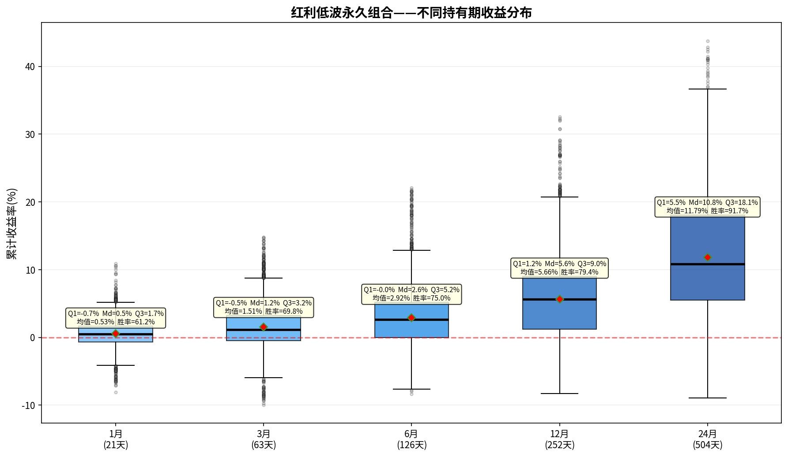

# 红利低波永久组合——持有期分析报告

> 初始本金：¥1,000,000  | 资产配置：25%股票+25%债券+25%黄金+25%现金
> 再平衡规则：±8%阈值 + 每年1月强制  |  单次成本：0.1%

---

## 一、收益分布箱线图

上图展示了该永久组合在不同持有期（1/3/6/12/24个月）下的累计收益率分布。
箱体范围 = 25%~75%分位数（Q₁~Q₃），中间横线 = 中位数（Md），红色菱形 = 均值。

---

## 二、各持有期详细统计

### 1月持有期（21个交易日）

| 统计指标 | 数值 |
|---------|------|
| 入场点数 | 3,699 |
| 平均收益 | +0.53% |
| 中位数收益（Md） | +0.47% |
| 下四分位（Q₁） | -0.67% |
| 上四分位（Q₃） | +1.67% |
| 四分位距（IQR=Q₃-Q₁） | 2.34% |
| 标准差 | 1.98% |
| 最佳收益 | +10.90% |
| 最差收益 | -8.07% |
| 收益区间跨度 | 18.97% |
| 胜率（收益>0） | 61.2% |

**解读：** 持有1月，该永久组合的中位数收益为+0.47%，半数入场点收益集中在-0.7%~+1.7%之间。
胜率61.2%，即每100次入场约有61次获得正收益。

### 3月持有期（63个交易日）

| 统计指标 | 数值 |
|---------|------|
| 入场点数 | 3,699 |
| 平均收益 | +1.51% |
| 中位数收益（Md） | +1.15% |
| 下四分位（Q₁） | -0.48% |
| 上四分位（Q₃） | +3.22% |
| 四分位距（IQR=Q₃-Q₁） | 3.70% |
| 标准差 | 3.28% |
| 最佳收益 | +14.79% |
| 最差收益 | -9.96% |
| 收益区间跨度 | 24.75% |
| 胜率（收益>0） | 69.8% |

**解读：** 持有3月，该永久组合的中位数收益为+1.15%，半数入场点收益集中在-0.5%~+3.2%之间。
胜率69.8%，即每100次入场约有69次获得正收益。

### 6月持有期（126个交易日）

| 统计指标 | 数值 |
|---------|------|
| 入场点数 | 3,699 |
| 平均收益 | +2.92% |
| 中位数收益（Md） | +2.65% |
| 下四分位（Q₁） | -0.00% |
| 上四分位（Q₃） | +5.17% |
| 四分位距（IQR=Q₃-Q₁） | 5.17% |
| 标准差 | 4.59% |
| 最佳收益 | +22.07% |
| 最差收益 | -8.38% |
| 收益区间跨度 | 30.45% |
| 胜率（收益>0） | 75.0% |

**解读：** 持有6月，该永久组合的中位数收益为+2.65%，半数入场点收益集中在-0.0%~+5.2%之间。
胜率75.0%，即每100次入场约有74次获得正收益。

### 12月持有期（252个交易日）

| 统计指标 | 数值 |
|---------|------|
| 入场点数 | 3,699 |
| 平均收益 | +5.66% |
| 中位数收益（Md） | +5.65% |
| 下四分位（Q₁） | +1.22% |
| 上四分位（Q₃） | +9.03% |
| 四分位距（IQR=Q₃-Q₁） | 7.82% |
| 标准差 | 6.16% |
| 最佳收益 | +32.54% |
| 最差收益 | -8.29% |
| 收益区间跨度 | 40.82% |
| 胜率（收益>0） | 79.4% |

**解读：** 持有12月，该永久组合的中位数收益为+5.65%，半数入场点收益集中在+1.2%~+9.0%之间。
胜率79.4%，即每100次入场约有79次获得正收益。

### 24月持有期（504个交易日）

| 统计指标 | 数值 |
|---------|------|
| 入场点数 | 3,699 |
| 平均收益 | +11.79% |
| 中位数收益（Md） | +10.82% |
| 下四分位（Q₁） | +5.50% |
| 上四分位（Q₃） | +18.06% |
| 四分位距（IQR=Q₃-Q₁） | 12.56% |
| 标准差 | 9.18% |
| 最佳收益 | +43.78% |
| 最差收益 | -8.95% |
| 收益区间跨度 | 52.73% |
| 胜率（收益>0） | 91.7% |

**解读：** 持有24月，该永久组合的中位数收益为+10.82%，半数入场点收益集中在+5.5%~+18.1%之间。
胜率91.7%，即每100次入场约有91次获得正收益。

---

## 三、持有期对比总结

| 指标 | 1月 | 3月 | 6月 | 12月 | 24月 |
|-----|-----|-----|-----|------|------|
| 平均收益 | +0.53% | +1.51% | +2.92% | +5.66% | +11.79% |
| 中位数收益 | +0.47% | +1.15% | +2.65% | +5.65% | +10.82% |
| 胜率 | 61.2% | 69.8% | 75.0% | 79.4% | 91.7% |
| 四分位距(IQR) | 2.34% | 3.70% | 5.17% | 7.82% | 12.56% |
| 最佳 | +10.90% | +14.79% | +22.07% | +32.54% | +43.78% |
| 最差 | -8.07% | -9.96% | -8.38% | -8.29% | -8.95% |

### 核心观察

1. **胜率趋势**：胜率从1月的61.2%提升至24月的91.7%，呈单调递增。
2. **持有24月收益**：中位数+10.82%，半数入场收益在+5.5%~+18.1%之间。
3. **收益稳定性**：四分位距从1月的2.34%扩大到24月的12.56%，说明持有期越长收益的不确定性也越大。
4. **风险考量**：最差情况为24月亏损9.0%，最佳情况盈利+43.8%。

---

*报告生成时间：2026-06-06*