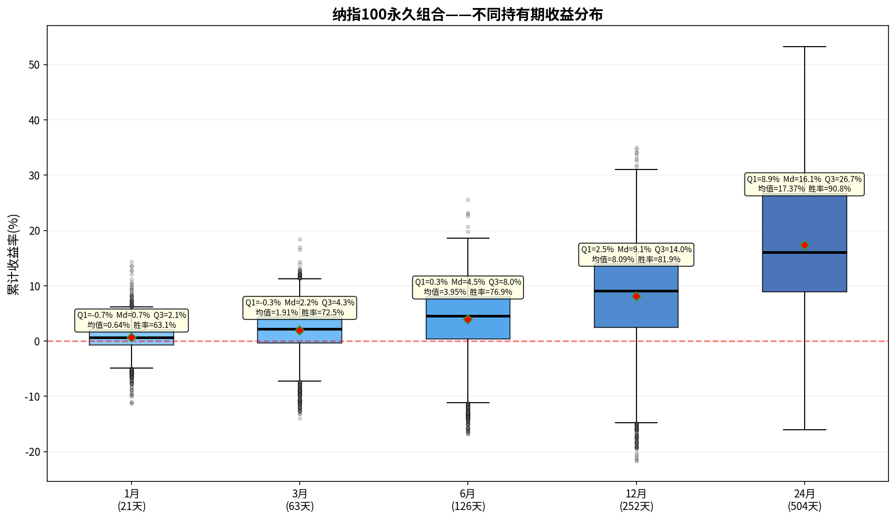

# 纳指100永久组合——持有期分析报告

> 初始本金：$100,000  | 资产配置：25%股票+25%债券+25%黄金+25%现金
> 再平衡规则：±8%阈值 + 每年1月强制  |  单次成本：0.1%

---

## 一、收益分布箱线图

上图展示了该永久组合在不同持有期（1/3/6/12/24个月）下的累计收益率分布。
箱体范围 = 25%~75%分位数（Q₁~Q₃），中间横线 = 中位数（Md），红色菱形 = 均值。

---

## 二、各持有期详细统计

### 1月持有期（21个交易日）

| 统计指标 | 数值 |
|---------|------|
| 入场点数 | 4,603 |
| 平均收益 | +0.64% |
| 中位数收益（Md） | +0.69% |
| 下四分位（Q₁） | -0.73% |
| 上四分位（Q₃） | +2.06% |
| 四分位距（IQR=Q₃-Q₁） | 2.78% |
| 标准差 | 2.36% |
| 最佳收益 | +14.39% |
| 最差收益 | -11.29% |
| 收益区间跨度 | 25.67% |
| 胜率（收益>0） | 63.1% |

**解读：** 持有1月，该永久组合的中位数收益为+0.69%，半数入场点收益集中在-0.7%~+2.1%之间。
胜率63.1%，即每100次入场约有63次获得正收益。

### 3月持有期（63个交易日）

| 统计指标 | 数值 |
|---------|------|
| 入场点数 | 4,603 |
| 平均收益 | +1.91% |
| 中位数收益（Md） | +2.20% |
| 下四分位（Q₁） | -0.31% |
| 上四分位（Q₃） | +4.34% |
| 四分位距（IQR=Q₃-Q₁） | 4.65% |
| 标准差 | 3.97% |
| 最佳收益 | +18.40% |
| 最差收益 | -13.96% |
| 收益区间跨度 | 32.35% |
| 胜率（收益>0） | 72.5% |

**解读：** 持有3月，该永久组合的中位数收益为+2.20%，半数入场点收益集中在-0.3%~+4.3%之间。
胜率72.5%，即每100次入场约有72次获得正收益。

### 6月持有期（126个交易日）

| 统计指标 | 数值 |
|---------|------|
| 入场点数 | 4,603 |
| 平均收益 | +3.95% |
| 中位数收益（Md） | +4.53% |
| 下四分位（Q₁） | +0.34% |
| 上四分位（Q₃） | +8.03% |
| 四分位距（IQR=Q₃-Q₁） | 7.69% |
| 标准差 | 5.80% |
| 最佳收益 | +25.59% |
| 最差收益 | -16.85% |
| 收益区间跨度 | 42.44% |
| 胜率（收益>0） | 76.9% |

**解读：** 持有6月，该永久组合的中位数收益为+4.53%，半数入场点收益集中在+0.3%~+8.0%之间。
胜率76.9%，即每100次入场约有76次获得正收益。

### 12月持有期（252个交易日）

| 统计指标 | 数值 |
|---------|------|
| 入场点数 | 4,603 |
| 平均收益 | +8.09% |
| 中位数收益（Md） | +9.10% |
| 下四分位（Q₁） | +2.46% |
| 上四分位（Q₃） | +13.96% |
| 四分位距（IQR=Q₃-Q₁） | 11.50% |
| 标准差 | 8.63% |
| 最佳收益 | +35.01% |
| 最差收益 | -21.62% |
| 收益区间跨度 | 56.64% |
| 胜率（收益>0） | 81.9% |

**解读：** 持有12月，该永久组合的中位数收益为+9.10%，半数入场点收益集中在+2.5%~+14.0%之间。
胜率81.9%，即每100次入场约有81次获得正收益。

### 24月持有期（504个交易日）

| 统计指标 | 数值 |
|---------|------|
| 入场点数 | 4,603 |
| 平均收益 | +17.37% |
| 中位数收益（Md） | +16.11% |
| 下四分位（Q₁） | +8.88% |
| 上四分位（Q₃） | +26.69% |
| 四分位距（IQR=Q₃-Q₁） | 17.81% |
| 标准差 | 13.12% |
| 最佳收益 | +53.27% |
| 最差收益 | -16.00% |
| 收益区间跨度 | 69.27% |
| 胜率（收益>0） | 90.8% |

**解读：** 持有24月，该永久组合的中位数收益为+16.11%，半数入场点收益集中在+8.9%~+26.7%之间。
胜率90.8%，即每100次入场约有90次获得正收益。

---

## 三、持有期对比总结

| 指标 | 1月 | 3月 | 6月 | 12月 | 24月 |
|-----|-----|-----|-----|------|------|
| 平均收益 | +0.64% | +1.91% | +3.95% | +8.09% | +17.37% |
| 中位数收益 | +0.69% | +2.20% | +4.53% | +9.10% | +16.11% |
| 胜率 | 63.1% | 72.5% | 76.9% | 81.9% | 90.8% |
| 四分位距(IQR) | 2.78% | 4.65% | 7.69% | 11.50% | 17.81% |
| 最佳 | +14.39% | +18.40% | +25.59% | +35.01% | +53.27% |
| 最差 | -11.29% | -13.96% | -16.85% | -21.62% | -16.00% |

### 核心观察

1. **胜率趋势**：胜率从1月的63.1%提升至24月的90.8%，呈单调递增。
2. **持有24月收益**：中位数+16.11%，半数入场收益在+8.9%~+26.7%之间。
3. **收益稳定性**：四分位距从1月的2.78%扩大到24月的17.81%，说明持有期越长收益的不确定性也越大。
4. **风险考量**：最差情况为24月亏损16.0%，最佳情况盈利+53.3%。

---

*报告生成时间：2026-06-06*